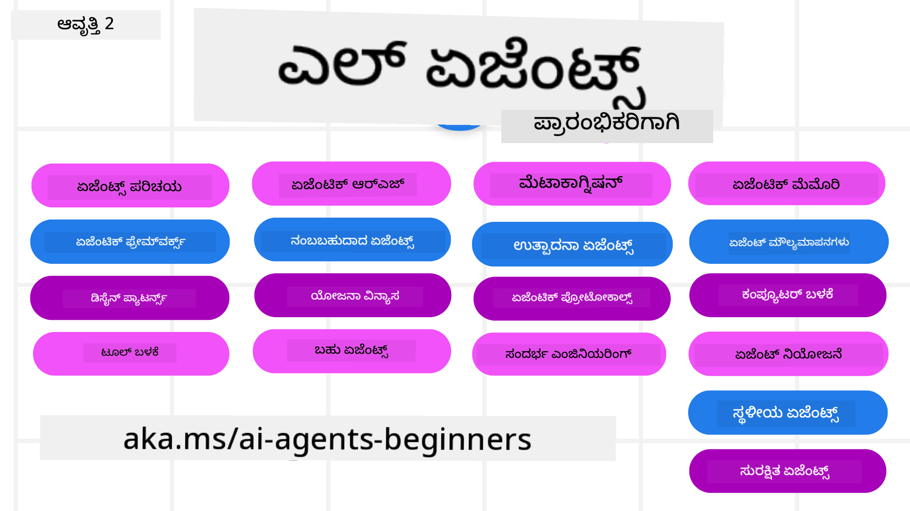

<!--
CO_OP_TRANSLATOR_METADATA:
{
  "original_hash": "218cf4d1ab3d9224f020f7e26155ef99",
  "translation_date": "2025-12-03T15:26:50+00:00",
  "source_file": "README.md",
  "language_code": "kn"
}
-->
# AI ಏಜೆಂಟ್ಸ್ ಪ್ರಾರಂಭಿಕರಿಗಾಗಿ - ಒಂದು ಕೋರ್ಸ್

## AI ಏಜೆಂಟ್ಸ್ ನಿರ್ಮಿಸಲು ಪ್ರಾರಂಭಿಸಲು ನಿಮಗೆ ಬೇಕಾದ ಎಲ್ಲವನ್ನೂ ಕಲಿಸುವ ಕೋರ್ಸ್

### 🌐 ಬಹುಭಾಷಾ ಬೆಂಬಲ

#### GitHub ಕ್ರಿಯೆಯ ಮೂಲಕ ಬೆಂಬಲಿತ (ಸ್ವಯಂಚಾಲಿತ ಮತ್ತು ಸದಾ ನವೀಕರಿತ)

<!-- CO-OP TRANSLATOR LANGUAGES TABLE START -->
[ಅರೇಬಿಕ್](../ar/README.md) | [ಬಂಗಾಳಿ](../bn/README.md) | [ಬಲ್ಗೇರಿಯನ್](../bg/README.md) | [ಬರ್ಮೀಸ್ (ಮ್ಯಾನ್ಮಾರ್)](../my/README.md) | [ಚೈನೀಸ್ (ಸರಳೀಕೃತ)](../zh/README.md) | [ಚೈನೀಸ್ (ಪಾರಂಪರಿಕ, ಹಾಂಗ್ ಕಾಂಗ್)](../hk/README.md) | [ಚೈನೀಸ್ (ಪಾರಂಪರಿಕ, ಮಕಾವ್)](../mo/README.md) | [ಚೈನೀಸ್ (ಪಾರಂಪರಿಕ, ತೈವಾನ್)](../tw/README.md) | [ಕ್ರೊಯೇಶಿಯನ್](../hr/README.md) | [ಚೆಕ್](../cs/README.md) | [ಡ್ಯಾನಿಶ್](../da/README.md) | [ಡಚ್](../nl/README.md) | [ಎಸ್ಟೋನಿಯನ್](../et/README.md) | [ಫಿನ್ನಿಷ್](../fi/README.md) | [ಫ್ರೆಂಚ್](../fr/README.md) | [ಜರ್ಮನ್](../de/README.md) | [ಗ್ರೀಕ್](../el/README.md) | [ಹೀಬ್ರೂ](../he/README.md) | [ಹಿಂದಿ](../hi/README.md) | [ಹಂಗೇರಿಯನ್](../hu/README.md) | [ಇಂಡೋನೇಶಿಯನ್](../id/README.md) | [ಇಟಾಲಿಯನ್](../it/README.md) | [ಜಪಾನೀಸ್](../ja/README.md) | [ಕನ್ನಡ](./README.md) | [ಕೊರಿಯನ್](../ko/README.md) | [ಲಿಥುವೇನಿಯನ್](../lt/README.md) | [ಮಲಯ್](../ms/README.md) | [ಮಲಯಾಳಂ](../ml/README.md) | [ಮರಾಠಿ](../mr/README.md) | [ನೇಪಾಳಿ](../ne/README.md) | [ನೈಜೀರಿಯನ್ ಪಿಡ್ಜಿನ್](../pcm/README.md) | [ನಾರ್ವೇಜಿಯನ್](../no/README.md) | [ಪರ್ಷಿಯನ್ (ಫಾರ್ಸಿ)](../fa/README.md) | [ಪೋಲಿಷ್](../pl/README.md) | [ಪೋರ್ಚುಗೀಸ್ (ಬ್ರೆಜಿಲ್)](../br/README.md) | [ಪೋರ್ಚುಗೀಸ್ (ಪೋರ್ಚುಗಲ್)](../pt/README.md) | [ಪಂಜಾಬಿ (ಗುರ್ಮುಖಿ)](../pa/README.md) | [ರೊಮೇನಿಯನ್](../ro/README.md) | [ರಷ್ಯನ್](../ru/README.md) | [ಸೆರ್ಬಿಯನ್ (ಸಿರಿಲಿಕ್)](../sr/README.md) | [ಸ್ಲೋವಾಕ್](../sk/README.md) | [ಸ್ಲೋವೆನಿಯನ್](../sl/README.md) | [ಸ್ಪಾನಿಷ್](../es/README.md) | [ಸ್ವಾಹಿಲಿ](../sw/README.md) | [ಸ್ವೀಡಿಷ್](../sv/README.md) | [ಟಾಗಾಲೊಗ್ (ಫಿಲಿಪಿನೋ)](../tl/README.md) | [ತಮಿಳು](../ta/README.md) | [ತೆಲುಗು](../te/README.md) | [ಥಾಯ್](../th/README.md) | [ಟರ್ಕಿಷ್](../tr/README.md) | [ಉಕ್ರೇನಿಯನ್](../uk/README.md) | [ಉರ್ದು](../ur/README.md) | [ವಿಯಟ್ನಾಮೀಸ್](../vi/README.md)
<!-- CO-OP TRANSLATOR LANGUAGES TABLE END -->

**ಹೆಚ್ಚುವರಿ ಭಾಷಾ ಅನುವಾದಗಳನ್ನು ಬೆಂಬಲಿಸಲು ಬಯಸಿದರೆ, [ಇಲ್ಲಿ](https://github.com/Azure/co-op-translator/blob/main/getting_started/supported-languages.md) ಪಟ್ಟಿ ಮಾಡಲಾಗಿದೆ**

## 🌱 ಪ್ರಾರಂಭಿಸಲು

ಈ ಕೋರ್ಸ್ AI ಏಜೆಂಟ್ಸ್ ನಿರ್ಮಾಣದ ಮೂಲಭೂತಗಳನ್ನು ಒಳಗೊಂಡ ಪಾಠಗಳನ್ನು ಹೊಂದಿದೆ. ಪ್ರತಿ ಪಾಠವು ತನ್ನದೇ ಆದ ವಿಷಯವನ್ನು ಒಳಗೊಂಡಿದೆ, ಆದ್ದರಿಂದ ನೀವು ಬಯಸಿದ ಸ್ಥಳದಿಂದ ಪ್ರಾರಂಭಿಸಬಹುದು!

ಈ ಕೋರ್ಸ್‌ಗೆ ಬಹುಭಾಷಾ ಬೆಂಬಲವಿದೆ. ನಮ್ಮ [ಲಭ್ಯವಿರುವ ಭಾಷೆಗಳಿಗೆ](../..) ಹೋಗಿ.

ನೀವು ಜನರೇಟಿವ್ AI ಮಾದರಿಗಳೊಂದಿಗೆ ಮೊದಲ ಬಾರಿಗೆ ನಿರ್ಮಿಸುತ್ತಿದ್ದರೆ, ನಮ್ಮ [ಜನರೇಟಿವ್ AI ಪ್ರಾರಂಭಿಕರಿಗಾಗಿ](https://aka.ms/genai-beginners) ಕೋರ್ಸ್ ಅನ್ನು ಪರಿಶೀಲಿಸಿ, ಇದು GenAI ಬಳಸಿ ನಿರ್ಮಾಣದ 21 ಪಾಠಗಳನ್ನು ಒಳಗೊಂಡಿದೆ.

ಈ ರೆಪೊವನ್ನು [ನಕ್ಷತ್ರ (🌟)](https://docs.github.com/en/get-started/exploring-projects-on-github/saving-repositories-with-stars?WT.mc_id=academic-105485-koreyst) ಮಾಡಿ ಮತ್ತು [ಫೋರ್ಕ್](https://github.com/microsoft/ai-agents-for-beginners/fork) ಮಾಡಿ ಕೋಡ್ ಅನ್ನು ಚಲಾಯಿಸಲು ಮರೆಯಬೇಡಿ.

### ಇತರ ಕಲಿಯುವವರನ್ನು ಭೇಟಿಯಾಗಿ, ನಿಮ್ಮ ಪ್ರಶ್ನೆಗಳಿಗೆ ಉತ್ತರ ಪಡೆಯಿರಿ

ನೀವು ಅಡಕವಾಗಿದ್ದರೆ ಅಥವಾ AI ಏಜೆಂಟ್ಸ್ ನಿರ್ಮಾಣದ ಬಗ್ಗೆ ಯಾವುದೇ ಪ್ರಶ್ನೆಗಳನ್ನು ಹೊಂದಿದ್ದರೆ, [Microsoft Foundry Discord](https://aka.ms/ai-agents/discord) ನಲ್ಲಿ ನಮ್ಮ ವಿಶೇಷ ಡಿಸ್ಕೋರ್ಡ್ ಚಾನೆಲ್‌ಗೆ ಸೇರಿ.

### ನಿಮಗೆ ಬೇಕಾದವು 

ಈ ಕೋರ್ಸ್‌ನ ಪ್ರತಿ ಪಾಠವು ಕೋಡ್ ಉದಾಹರಣೆಗಳನ್ನು ಒಳಗೊಂಡಿದೆ, ಅವುಗಳನ್ನು code_samples ಫೋಲ್ಡರ್‌ನಲ್ಲಿ ಕಾಣಬಹುದು. ನೀವು ನಿಮ್ಮದೇ ಆದ ಪ್ರತಿಯನ್ನು ಸೃಷ್ಟಿಸಲು ಈ ರೆಪೊವನ್ನು [ಫೋರ್ಕ್](https://github.com/microsoft/ai-agents-for-beginners/fork) ಮಾಡಬಹುದು.

ಈ ವ್ಯಾಯಾಮಗಳಲ್ಲಿ ಕೋಡ್ ಉದಾಹರಣೆಗಳು, ಭಾಷಾ ಮಾದರಿಗಳೊಂದಿಗೆ ಸಂವಹನಕ್ಕಾಗಿ Azure AI Foundry ಮತ್ತು GitHub Model Catalogs ಅನ್ನು ಬಳಸುತ್ತವೆ:

- [GitHub ಮಾದರಿಗಳು](https://aka.ms/ai-agents-beginners/github-models) - ಉಚಿತ / ಮಿತ
- [Azure AI Foundry](https://aka.ms/ai-agents-beginners/ai-foundry) - Azure ಖಾತೆ ಅಗತ್ಯವಿದೆ

ಈ ಕೋರ್ಸ್ Microsoft ನಿಂದ ಈ ಕೆಳಗಿನ AI ಏಜೆಂಟ್ ಫ್ರೇಮ್‌ವರ್ಕ್‌ಗಳು ಮತ್ತು ಸೇವೆಗಳನ್ನು ಬಳಸುತ್ತದೆ:

- [Microsoft Agent Framework (MAF) - ಹೊಸದು!](https://aka.ms/ai-agents-beginners/agent-framewrok)
- [Azure AI Agent Service](https://aka.ms/ai-agents-beginners/ai-agent-service)
- [Semantic Kernel](https://aka.ms/ai-agents-beginners/semantic-kernel)
- [AutoGen](https://aka.ms/ai-agents/autogen)

ಈ ಕೋರ್ಸ್‌ನ ಕೋಡ್ ಚಲಾಯಿಸುವ ಬಗ್ಗೆ ಹೆಚ್ಚಿನ ಮಾಹಿತಿಗಾಗಿ, [ಕೋರ್ಸ್ ಸೆಟಪ್](./00-course-setup/README.md) ಗೆ ಹೋಗಿ.

## 🙏 ಸಹಾಯ ಮಾಡಲು ಬಯಸುತ್ತೀರಾ?

ನೀವು ಸಲಹೆಗಳನ್ನು ಹೊಂದಿದ್ದೀರಾ ಅಥವಾ ವಾಕ್ಯಶುದ್ಧಿ ಅಥವಾ ಕೋಡ್ ದೋಷಗಳನ್ನು ಕಂಡುಹಿಡಿದಿದ್ದೀರಾ? [ಸಮಸ್ಯೆಯನ್ನು ಎತ್ತಿ](https://github.com/microsoft/ai-agents-for-beginners/issues?WT.mc_id=academic-105485-koreyst) ಅಥವಾ [ಪುಲ್ ರಿಕ್ವೆಸ್ಟ್ ಸೃಷ್ಟಿಸಿ](https://github.com/microsoft/ai-agents-for-beginners/pulls?WT.mc_id=academic-105485-koreyst).

## 📂 ಪ್ರತಿ ಪಾಠವು ಒಳಗೊಂಡಿದೆ

- README ನಲ್ಲಿ ಲಿಖಿತ ಪಾಠ ಮತ್ತು ಒಂದು ಚಿಕ್ಕ ವೀಡಿಯೊ
- Azure AI Foundry ಮತ್ತು GitHub Models (ಉಚಿತ) ಅನ್ನು ಬೆಂಬಲಿಸುವ Python ಕೋಡ್ ಉದಾಹರಣೆಗಳು
- ನಿಮ್ಮ ಕಲಿಕೆಯನ್ನು ಮುಂದುವರಿಸಲು ಹೆಚ್ಚುವರಿ ಸಂಪತ್ತುಗಳಿಗೆ ಲಿಂಕ್‌ಗಳು

## 🗃️ ಪಾಠಗಳು

| **ಪಾಠ**                                     | **ಪಠ್ಯ ಮತ್ತು ಕೋಡ್**                                | **ವೀಡಿಯೊ**                                                  | **ಹೆಚ್ಚುವರಿ ಕಲಿಕೆ**                                                                     |
|----------------------------------------------|----------------------------------------------------|------------------------------------------------------------|----------------------------------------------------------------------------------------|
| AI ಏಜೆಂಟ್ಸ್ ಮತ್ತು ಏಜೆಂಟ್ ಬಳಕೆ ಪ್ರಕರಣಗಳಿಗೆ ಪರಿಚಯ | [ಲಿಂಕ್](./01-intro-to-ai-agents/README.md)          | [ವೀಡಿಯೊ](https://youtu.be/3zgm60bXmQk?si=z8QygFvYQv-9WtO1)  | [ಲಿಂಕ್](https://aka.ms/ai-agents-beginners/collection?WT.mc_id=academic-105485-koreyst) |
| AI ಏಜೆಂಟಿಕ್ ಫ್ರೇಮ್‌ವರ್ಕ್‌ಗಳನ್ನು ಅನ್ವೇಷಣೆ     | [ಲಿಂಕ್](./02-explore-agentic-frameworks/README.md)  | [ವೀಡಿಯೊ](https://youtu.be/ODwF-EZo_O8?si=Vawth4hzVaHv-u0H)  | [ಲಿಂಕ್](https://aka.ms/ai-agents-beginners/collection?WT.mc_id=academic-105485-koreyst) |
| AI ಏಜೆಂಟಿಕ್ ವಿನ್ಯಾಸ ಮಾದರಿಗಳನ್ನು ಅರ್ಥಮಾಡಿಕೊಳ್ಳುವುದು | [ಲಿಂಕ್](./03-agentic-design-patterns/README.md)     | [ವೀಡಿಯೊ](https://youtu.be/m9lM8qqoOEA?si=BIzHwzstTPL8o9GF)  | [ಲಿಂಕ್](https://aka.ms/ai-agents-beginners/collection?WT.mc_id=academic-105485-koreyst) |
| ಸಾಧನ ಬಳಕೆ ವಿನ್ಯಾಸ ಮಾದರಿ                      | [ಲಿಂಕ್](./04-tool-use/README.md)                    | [ವೀಡಿಯೊ](https://youtu.be/vieRiPRx-gI?si=2z6O2Xu2cu_Jz46N)  | [ಲಿಂಕ್](https://aka.ms/ai-agents-beginners/collection?WT.mc_id=academic-105485-koreyst) |
| ಏಜೆಂಟಿಕ್ RAG                                | [ಲಿಂಕ್](./05-agentic-rag/README.md)                 | [ವೀಡಿಯೊ](https://youtu.be/WcjAARvdL7I?si=gKPWsQpKiIlDH9A3)  | [ಲಿಂಕ್](https://aka.ms/ai-agents-beginners/collection?WT.mc_id=academic-105485-koreyst) |
| ವಿಶ್ವಾಸಾರ್ಹ AI ಏಜೆಂಟ್ಸ್ ನಿರ್ಮಾಣ              | [ಲಿಂಕ್](./06-building-trustworthy-agents/README.md) | [ವೀಡಿಯೊ](https://youtu.be/iZKkMEGBCUQ?si=jZjpiMnGFOE9L8OK ) | [ಲಿಂಕ್](https://aka.ms/ai-agents-beginners/collection?WT.mc_id=academic-105485-koreyst) |
| ಯೋಜನೆ ವಿನ್ಯಾಸ ಮಾದರಿ                          | [ಲಿಂಕ್](./07-planning-design/README.md)             | [ವೀಡಿಯೊ](https://youtu.be/kPfJ2BrBCMY?si=6SC_iv_E5-mzucnC)  | [ಲಿಂಕ್](https://aka.ms/ai-agents-beginners/collection?WT.mc_id=academic-105485-koreyst) |
| ಬಹು-ಏಜೆಂಟ್ ವಿನ್ಯಾಸ ಮಾದರಿ                    | [ಲಿಂಕ್](./08-multi-agent/README.md)                 | [ವೀಡಿಯೊ](https://youtu.be/V6HpE9hZEx0?si=rMgDhEu7wXo2uo6g)  | [ಲಿಂಕ್](https://aka.ms/ai-agents-beginners/collection?WT.mc_id=academic-105485-koreyst) |
| ಮೆಟಾಕಾಗ್ನಿಷನ್ ವಿನ್ಯಾಸ ಮಾದರಿ                  | [ಲಿಂಕ್](./09-metacognition/README.md)               | [ವೀಡಿಯೊ](https://youtu.be/His9R6gw6Ec?si=8gck6vvdSNCt6OcF)  | [ಲಿಂಕ್](https://aka.ms/ai-agents-beginners/collection?WT.mc_id=academic-105485-koreyst) |
| ಉತ್ಪಾದನೆಯಲ್ಲಿ AI ಏಜೆಂಟ್‌ಗಳು                      | [Link](./10-ai-agents-production/README.md)        | [Video](https://youtu.be/l4TP6IyJxmQ?si=31dnhexRo6yLRJDl)  | [Link](https://aka.ms/ai-agents-beginners/collection?WT.mc_id=academic-105485-koreyst) |
| ಏಜೆಂಟಿಕ್ ಪ್ರೋಟೋಕಾಲ್‌ಗಳನ್ನು ಬಳಸುವುದು (MCP, A2A ಮತ್ತು NLWeb) | [Link](./11-agentic-protocols/README.md)           | [Video](https://youtu.be/X-Dh9R3Opn8)                                 | [Link](https://aka.ms/ai-agents-beginners/collection?WT.mc_id=academic-105485-koreyst) |
| AI ಏಜೆಂಟ್‌ಗಳಿಗಾಗಿ ಕಾನ್ಟೆಕ್ಸ್‌ಟ್ ಎಂಜಿನಿಯರಿಂಗ್            | [Link](./12-context-engineering/README.md)         | [Video](https://youtu.be/F5zqRV7gEag)                                 | [Link](https://aka.ms/ai-agents-beginners/collection?WT.mc_id=academic-105485-koreyst) |
| ಏಜೆಂಟಿಕ್ ಮೆಮೊರಿಯನ್ನು ನಿರ್ವಹಿಸುವುದು                      | [Link](./13-agent-memory/README.md)     |      [Video](https://youtu.be/QrYbHesIxpw?si=vZkVwKrQ4ieCcIPx)                                                      |                                                                                        |
| ಮೈಕ್ರೋಸಾಫ್ಟ್ ಏಜೆಂಟ್ ಫ್ರೇಮ್‌ವರ್ಕ್ ಅನ್ನು ಅನ್ವೇಷಿಸುವುದು                         | [Link](./14-microsoft-agent-framework/README.md)                            |                                                            |                                                                                        |
| ಕಂಪ್ಯೂಟರ್ ಬಳಕೆ ಏಜೆಂಟ್‌ಗಳನ್ನು ನಿರ್ಮಿಸುವುದು           | Coming Soon                            |                                                            |                                                                                        |
| ಸ್ಕೇಲಬಲ್ ಏಜೆಂಟ್‌ಗಳನ್ನು ಡಿಪ್ಲಾಯ್ ಮಾಡುವುದು                    | Coming Soon                            |                                                            |                                                                                        |
| ಸ್ಥಳೀಯ AI ಏಜೆಂಟ್‌ಗಳನ್ನು ರಚಿಸುವುದು                     | Coming Soon                               |                                                            |                                                                                        |
| AI ಏಜೆಂಟ್‌ಗಳನ್ನು ಸುರಕ್ಷಿತಗೊಳಿಸುವುದು                           | Coming Soon                               |                                                            |                                                                                        |

## 🎒 ಇತರ ಕೋರ್ಸ್‌ಗಳು

ನಮ್ಮ ತಂಡ ಇತರ ಕೋರ್ಸ್‌ಗಳನ್ನು ಉತ್ಪಾದಿಸುತ್ತದೆ! ನೋಡಿ:

<!-- CO-OP TRANSLATOR OTHER COURSES START -->
### Azure / Edge / MCP / Agents

---
 
### ಜನರೇಟಿವ್ AI ಸರಣಿ

[-9333EA?style=for-the-badge&labelColor=E5E7EB&color=9333EA)](https://github.com/microsoft/Generative-AI-for-beginners-dotnet?WT.mc_id=academic-105485-koreyst)
[-C084FC?style=for-the-badge&labelColor=E5E7EB&color=C084FC)](https://github.com/microsoft/generative-ai-for-beginners-java?WT.mc_id=academic-105485-koreyst)
[-E879F9?style=for-the-badge&labelColor=E5E7EB&color=E879F9)](https://github.com/microsoft/generative-ai-with-javascript?WT.mc_id=academic-105485-koreyst)

---
 
### ಕೋರ್ ಲರ್ನಿಂಗ್

---
 
### Copilot ಸರಣಿ

<!-- CO-OP TRANSLATOR OTHER COURSES END -->

## 🌟 ಸಮುದಾಯ ಧನ್ಯವಾದಗಳು

Agentic RAG ಅನ್ನು ತೋರಿಸುವ ಪ್ರಮುಖ ಕೋಡ್ ಮಾದರಿಗಳನ್ನು ಕೊಡುಗೆ ನೀಡಿದ [Shivam Goyal](https://www.linkedin.com/in/shivam2003/) ಗೆ ಧನ್ಯವಾದಗಳು. 

## ಕೊಡುಗೆ ನೀಡುವುದು

ಈ ಪ್ರಾಜೆಕ್ಟ್ ಕೊಡುಗೆಗಳನ್ನು ಮತ್ತು ಸಲಹೆಗಳನ್ನು ಸ್ವಾಗತಿಸುತ್ತದೆ.  ಹೆಚ್ಚಿನ ಕೊಡುಗೆಗಳು ನಿಮಗೆ ಒಪ್ಪಂದದ
Contributor License Agreement (CLA) ಒಪ್ಪಿಕೊಳ್ಳಬೇಕಾಗುತ್ತದೆ, ಇದು ನೀವು ನಿಮ್ಮ ಕೊಡುಗೆಯನ್ನು ಬಳಸಲು ನಮಗೆ ಹಕ್ಕುಗಳನ್ನು ನೀಡುತ್ತೀರಿ ಎಂದು ಘೋಷಿಸುತ್ತದೆ. ವಿವರಗಳಿಗೆ, <https://cla.opensource.microsoft.com> ಗೆ ಭೇಟಿ ನೀಡಿ.

ನೀವು ಪುಲ್ ರಿಕ್ವೆಸ್ಟ್ ಸಲ್ಲಿಸಿದಾಗ, CLA ಬಾಟ್ ಸ್ವಯಂಚಾಲಿತವಾಗಿ ನೀವು CLA ಒದಗಿಸಬೇಕೇ ಎಂದು ನಿರ್ಧರಿಸುತ್ತದೆ ಮತ್ತು PR ಅನ್ನು ಸೂಕ್ತವಾಗಿ ಅಲಂಕರಿಸುತ್ತದೆ (ಉದಾ., ಸ್ಥಿತಿ ಪರಿಶೀಲನೆ, ಕಾಮೆಂಟ್). ಬಾಟ್ ನೀಡುವ ಸೂಚನೆಗಳನ್ನು ಅನುಸರಿಸಿ. ನೀವು ನಮ್ಮ CLA ಅನ್ನು ಬಳಸುವ ಎಲ್ಲಾ ರೆಪೊಗಳಲ್ಲಿ ಇದನ್ನು ಒಂದೇ ಬಾರಿ ಮಾಡಬೇಕಾಗುತ್ತದೆ.

ಈ ಪ್ರಾಜೆಕ್ಟ್ [Microsoft Open Source Code of Conduct](https://opensource.microsoft.com/codeofconduct/) ಅನ್ನು ಅಳವಡಿಸಿಕೊಂಡಿದೆ.
ಹೆಚ್ಚಿನ ಮಾಹಿತಿಗಾಗಿ [Code of Conduct FAQ](https://opensource.microsoft.com/codeofconduct/faq/) ಗೆ ಭೇಟಿ ನೀಡಿ ಅಥವಾ [opencode@microsoft.com](mailto:opencode@microsoft.com) ಗೆ ಯಾವುದೇ ಹೆಚ್ಚುವರಿ ಪ್ರಶ್ನೆಗಳು ಅಥವಾ ಕಾಮೆಂಟ್‌ಗಳನ್ನು ಕಳುಹಿಸಿ.

## ಟ್ರೇಡ್‌ಮಾರ್ಕ್‌ಗಳು

ಈ ಪ್ರಾಜೆಕ್ಟ್ ಪ್ರಾಜೆಕ್ಟ್‌ಗಳು, ಉತ್ಪನ್ನಗಳು ಅಥವಾ ಸೇವೆಗಳ ಟ್ರೇಡ್‌ಮಾರ್ಕ್‌ಗಳು ಅಥವಾ ಲೋಗೋಗಳನ್ನು ಹೊಂದಿರಬಹುದು. Microsoft ಟ್ರೇಡ್‌ಮಾರ್ಕ್‌ಗಳು ಅಥವಾ ಲೋಗೋಗಳನ್ನು ಅನುಮೋದಿತ ಬಳಕೆ [Microsoft's Trademark & Brand Guidelines](https://www.microsoft.com/legal/intellectualproperty/trademarks/usage/general) ಅನ್ನು ಅನುಸರಿಸಬೇಕು.
ಈ ಪ್ರಾಜೆಕ್ಟ್‌ನ ತಿದ್ದುಪಡಿ ಮಾಡಲಾದ ಆವೃತ್ತಿಗಳಲ್ಲಿ Microsoft ಟ್ರೇಡ್‌ಮಾರ್ಕ್‌ಗಳು ಅಥವಾ ಲೋಗೋಗಳನ್ನು ಬಳಸುವುದು ಗೊಂದಲವನ್ನು ಉಂಟುಮಾಡಬಾರದು ಅಥವಾ Microsoft ಪ್ರಾಯೋಜಕತ್ವವನ್ನು ಸೂಚಿಸಬಾರದು.
ಮೂರನೇ ಪಕ್ಷದ ಟ್ರೇಡ್‌ಮಾರ್ಕ್‌ಗಳು ಅಥವಾ ಲೋಗೋಗಳನ್ನು ಬಳಸುವುದು ಆ ಮೂರನೇ ಪಕ್ಷದ ನೀತಿಗಳನ್ನು ಅನುಸರಿಸಬೇಕು.

## ಸಹಾಯ ಪಡೆಯುವುದು

ನೀವು AI ಅಪ್ಲಿಕೇಶನ್‌ಗಳನ್ನು ನಿರ್ಮಿಸುವಲ್ಲಿ ಅಡಕವಾಗಿದ್ದರೆ ಅಥವಾ ಯಾವುದೇ ಪ್ರಶ್ನೆಗಳಿದ್ದರೆ, ಸೇರಿ:

ನೀವು ಉತ್ಪನ್ನದ ಪ್ರತಿಕ್ರಿಯೆ ಅಥವಾ ನಿರ್ಮಿಸುವಾಗ ದೋಷಗಳನ್ನು ಹೊಂದಿದ್ದರೆ, ಭೇಟಿ ನೀಡಿ:

---

<!-- CO-OP TRANSLATOR DISCLAIMER START -->
**ಅಸ್ವೀಕಾರ**:  
ಈ ದಸ್ತಾವೇಜು AI ಅನುವಾದ ಸೇವೆ [Co-op Translator](https://github.com/Azure/co-op-translator) ಬಳಸಿ ಅನುವಾದಿಸಲಾಗಿದೆ. ನಾವು ನಿಖರತೆಯನ್ನು ಸಾಧಿಸಲು ಪ್ರಯತ್ನಿಸುತ್ತಿದ್ದರೂ, ದಯವಿಟ್ಟು ಗಮನಿಸಿ, ಸ್ವಯಂಚಾಲಿತ ಅನುವಾದಗಳಲ್ಲಿ ದೋಷಗಳು ಅಥವಾ ಅಸಡ್ಡೆಗಳು ಇರಬಹುದು. ಮೂಲ ಭಾಷೆಯಲ್ಲಿರುವ ಮೂಲ ದಸ್ತಾವೇಜು ಪ್ರಾಮಾಣಿಕ ಮೂಲವೆಂದು ಪರಿಗಣಿಸಬೇಕು. ಮಹತ್ವದ ಮಾಹಿತಿಗಾಗಿ, ವೃತ್ತಿಪರ ಮಾನವ ಅನುವಾದವನ್ನು ಶಿಫಾರಸು ಮಾಡಲಾಗುತ್ತದೆ. ಈ ಅನುವಾದವನ್ನು ಬಳಸುವ ಮೂಲಕ ಉಂಟಾಗುವ ಯಾವುದೇ ತಪ್ಪು ಅರ್ಥಗಳ ಅಥವಾ ತಪ್ಪು ವ್ಯಾಖ್ಯಾನಗಳ ಬಗ್ಗೆ ನಾವು ಹೊಣೆಗಾರರಲ್ಲ.
<!-- CO-OP TRANSLATOR DISCLAIMER END -->