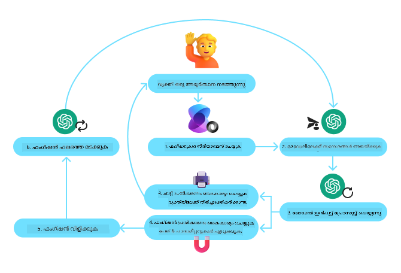

<!--
CO_OP_TRANSLATOR_METADATA:
{
  "original_hash": "d7c3b7bd1b3528074d8b6a7c5ad33b6f",
  "translation_date": "2025-12-03T16:52:14+00:00",
  "source_file": "04-tool-use/README.md",
  "language_code": "ml"
}
-->
[](https://youtu.be/vieRiPRx-gI?si=cEZ8ApnT6Sus9rhn)

> _(മുകളിൽ കാണുന്ന ചിത്രം ക്ലിക്ക് ചെയ്ത് ഈ പാഠത്തിന്റെ വീഡിയോ കാണുക)_

# ടൂൾ ഉപയോഗ ഡിസൈൻ പാറ്റേൺ

ടൂളുകൾ ആകർഷകമാണ്, കാരണം ഇവ AI ഏജന്റുകൾക്ക് കൂടുതൽ ശേഷികൾ നൽകുന്നു. ഏജന്റിന് നിർവഹിക്കാൻ കഴിയുന്ന പ്രവർത്തനങ്ങളുടെ പരിമിതമായ ഒരു സെറ്റ് മാത്രമുണ്ടായിരുന്നെങ്കിൽ, ഒരു ടൂൾ ചേർത്താൽ, ഏജന്റിന് ഇപ്പോൾ വ്യാപകമായ പ്രവർത്തനങ്ങൾ നിർവഹിക്കാൻ കഴിയും. ഈ അധ്യായത്തിൽ, AI ഏജന്റുകൾ അവരുടെ ലക്ഷ്യങ്ങൾ നേടാൻ പ്രത്യേക ടൂളുകൾ എങ്ങനെ ഉപയോഗിക്കാമെന്ന് വിവരിക്കുന്ന ടൂൾ ഉപയോഗ ഡിസൈൻ പാറ്റേൺ പരിശോധിക്കാം.

## പരിചയം

ഈ പാഠത്തിൽ, താഴെ പറയുന്ന ചോദ്യങ്ങൾക്ക് ഉത്തരം കണ്ടെത്തുകയാണ് ലക്ഷ്യം:

- ടൂൾ ഉപയോഗ ഡിസൈൻ പാറ്റേൺ എന്താണ്?
- ഇത് പ്രയോഗിക്കാവുന്ന ഉപയോഗ കേസുകൾ എന്തൊക്കെയാണ്?
- ഡിസൈൻ പാറ്റേൺ നടപ്പിലാക്കാൻ ആവശ്യമായ ഘടകങ്ങൾ/നിർമ്മാണ ഘടനകൾ എന്തൊക്കെയാണ്?
- വിശ്വസനീയമായ AI ഏജന്റുകൾ നിർമ്മിക്കാൻ ടൂൾ ഉപയോഗ ഡിസൈൻ പാറ്റേൺ ഉപയോഗിക്കുന്നതിന് പ്രത്യേക പരിഗണനകൾ എന്തൊക്കെയാണ്?

## പഠന ലക്ഷ്യങ്ങൾ

ഈ പാഠം പൂർത്തിയാക്കിയ ശേഷം, നിങ്ങൾക്ക് കഴിയും:

- ടൂൾ ഉപയോഗ ഡിസൈൻ പാറ്റേൺ എന്താണെന്ന് അതിന്റെ ലക്ഷ്യം വ്യക്തമാക്കുക.
- ടൂൾ ഉപയോഗ ഡിസൈൻ പാറ്റേൺ പ്രയോഗിക്കാവുന്ന ഉപയോഗ കേസുകൾ തിരിച്ചറിയുക.
- ഡിസൈൻ പാറ്റേൺ നടപ്പിലാക്കാൻ ആവശ്യമായ പ്രധാന ഘടകങ്ങൾ മനസ്സിലാക്കുക.
- ഈ ഡിസൈൻ പാറ്റേൺ ഉപയോഗിച്ച് AI ഏജന്റുകളുടെ വിശ്വസനീയത ഉറപ്പാക്കാനുള്ള പരിഗണനകൾ തിരിച്ചറിയുക.

## ടൂൾ ഉപയോഗ ഡിസൈൻ പാറ്റേൺ എന്താണ്?

**ടൂൾ ഉപയോഗ ഡിസൈൻ പാറ്റേൺ** LLMs-ന് പ്രത്യേക ലക്ഷ്യങ്ങൾ നേടാൻ ബാഹ്യ ടൂളുകളുമായി ഇടപഴകാനുള്ള കഴിവ് നൽകുന്നതിൽ ശ്രദ്ധ കേന്ദ്രീകരിക്കുന്നു. ടൂളുകൾ ഏജന്റിന് പ്രവർത്തനങ്ങൾ നിർവഹിക്കാൻ കഴിയുന്ന കോഡാണ്. ഒരു ടൂൾ കാൽക്കുലേറ്റർ പോലുള്ള ലളിതമായ ഒരു ഫംഗ്ഷനോ, സ്റ്റോക്ക് വില പരിശോധിക്കലോ കാലാവസ്ഥ പ്രവചനമോ പോലുള്ള മൂന്നാം കക്ഷി സേവനത്തിന് API കോൾ ചെയ്യലോ ആകാം. AI ഏജന്റുകളുടെ സാഹചര്യത്തിൽ, **മോഡൽ-ജനിത ഫംഗ്ഷൻ കോൾ**-കളുടെ പ്രതികരണമായി ടൂളുകൾ ഏജന്റുകൾക്ക് നിർവഹിക്കാൻ രൂപകൽപ്പന ചെയ്തിരിക്കുന്നു.

## ഇത് പ്രയോഗിക്കാവുന്ന ഉപയോഗ കേസുകൾ എന്തൊക്കെയാണ്?

AI ഏജന്റുകൾ സങ്കീർണ്ണമായ പ്രവർത്തനങ്ങൾ പൂർത്തിയാക്കാൻ, വിവരങ്ങൾ തിരികെ നേടാൻ, അല്ലെങ്കിൽ തീരുമാനങ്ങൾ എടുക്കാൻ ടൂളുകൾ ഉപയോഗിക്കാം. ടൂൾ ഉപയോഗ ഡിസൈൻ പാറ്റേൺ ഡൈനാമിക് ആയി ബാഹ്യ സിസ്റ്റങ്ങളുമായി ഇടപഴകേണ്ട സാഹചര്യങ്ങളിൽ സാധാരണയായി ഉപയോഗിക്കുന്നു, ഉദാഹരണത്തിന് ഡാറ്റാബേസുകൾ, വെബ് സേവനങ്ങൾ, അല്ലെങ്കിൽ കോഡ് ഇൻറർപ്രീറ്ററുകൾ. ഈ കഴിവ് വിവിധ ഉപയോഗ കേസുകൾക്കായി പ്രയോജനകരമാണ്, അതിൽ ചിലത്:

- **ഡൈനാമിക് ഇൻഫർമേഷൻ റിട്രീവൽ:** ഏജന്റുകൾ SQLite ഡാറ്റാബേസിൽ നിന്ന് ഡാറ്റാ വിശകലനം ചെയ്യുക, സ്റ്റോക്ക് വിലകൾ അല്ലെങ്കിൽ കാലാവസ്ഥാ വിവരങ്ങൾ തിരയുക തുടങ്ങിയ പ്രവർത്തനങ്ങൾക്കായി ബാഹ്യ API-കളോ ഡാറ്റാബേസുകളോ ചോദ്യം ചെയ്യാൻ കഴിയും.
- **കോഡ് എക്സിക്യൂഷൻ ആൻഡ് ഇൻറർപ്രിറ്റേഷൻ:** ഗണിത പ്രശ്നങ്ങൾ പരിഹരിക്കാൻ, റിപ്പോർട്ടുകൾ സൃഷ്ടിക്കാൻ, അല്ലെങ്കിൽ സിമുലേഷനുകൾ നടത്താൻ ഏജന്റുകൾ കോഡ് അല്ലെങ്കിൽ സ്ക്രിപ്റ്റുകൾ പ്രവർത്തിപ്പിക്കാം.
- **വർക്ക്ഫ്ലോ ഓട്ടോമേഷൻ:** ടാസ്‌ക് ഷെഡ്യൂളറുകൾ, ഇമെയിൽ സേവനങ്ങൾ, അല്ലെങ്കിൽ ഡാറ്റാ പൈപ്പ്‌ലൈനുകൾ പോലുള്ള ടൂളുകൾ സംയോജിപ്പിച്ച് ആവർത്തനാത്മകമായ അല്ലെങ്കിൽ മൾട്ടി-സ്റ്റെപ്പ് വർക്ക്ഫ്ലോകൾ ഓട്ടോമേറ്റ് ചെയ്യുക.
- **കസ്റ്റമർ സപ്പോർട്ട്:** CRM സിസ്റ്റങ്ങൾ, ടിക്കറ്റിംഗ് പ്ലാറ്റ്ഫോമുകൾ, അല്ലെങ്കിൽ നോളേജ് ബേസുകൾ ഉപയോഗിച്ച് ഉപയോക്തൃ ചോദ്യങ്ങൾ പരിഹരിക്കാൻ ഏജന്റുകൾക്ക് കഴിയും.
- **കണ്ടന്റ് ജനറേഷൻ ആൻഡ് എഡിറ്റിംഗ്:** ഗ്രാമർ ചെക്കറുകൾ, ടെക്സ്റ്റ് സംഗ്രഹങ്ങൾ, അല്ലെങ്കിൽ കണ്ടന്റ് സുരക്ഷാ വിലയിരുത്തൽ ടൂളുകൾ പോലുള്ള ടൂളുകൾ ഉപയോഗിച്ച് കണ്ടന്റ് സൃഷ്ടി പ്രവർത്തനങ്ങളിൽ സഹായിക്കുക.

## ടൂൾ ഉപയോഗ ഡിസൈൻ പാറ്റേൺ നടപ്പിലാക്കാൻ ആവശ്യമായ ഘടകങ്ങൾ/നിർമ്മാണ ഘടനകൾ എന്തൊക്കെയാണ്?

ഈ ഘടകങ്ങൾ AI ഏജന്റിന് വ്യാപകമായ പ്രവർത്തനങ്ങൾ നിർവഹിക്കാൻ സഹായിക്കുന്നു. ടൂൾ ഉപയോഗ ഡിസൈൻ പാറ്റേൺ നടപ്പിലാക്കാൻ ആവശ്യമായ പ്രധാന ഘടകങ്ങൾ നോക്കാം:

- **ഫംഗ്ഷൻ/ടൂൾ സ്കീമകൾ:** ലഭ്യമായ ടൂളുകളുടെ വിശദമായ നിർവചനങ്ങൾ, ഫംഗ്ഷൻ പേര്, ലക്ഷ്യം, ആവശ്യമായ പാരാമീറ്ററുകൾ, പ്രതീക്ഷിക്കുന്ന ഔട്ട്പുട്ടുകൾ എന്നിവ ഉൾപ്പെടുന്നു. ഈ സ്കീമകൾ LLM-ന് ലഭ്യമായ ടൂളുകൾ എന്തൊക്കെയാണെന്ന്, എങ്ങനെ സാധുവായ അഭ്യർത്ഥനകൾ നിർമ്മിക്കാമെന്ന് മനസ്സിലാക്കാൻ സഹായിക്കുന്നു.

- **ഫംഗ്ഷൻ എക്സിക്യൂഷൻ ലോജിക്:** ഉപയോക്താവിന്റെ ഉദ്ദേശവും സംഭാഷണ സാഹചര്യവും അടിസ്ഥാനമാക്കി ടൂളുകൾ എപ്പോൾ, എങ്ങനെ വിളിക്കണം എന്ന് നിയന്ത്രിക്കുന്നു. ഇത് പ്ലാനർ മോഡ്യൂളുകൾ, റൂട്ടിംഗ് മെക്കാനിസങ്ങൾ, അല്ലെങ്കിൽ ടൂൾ ഉപയോഗം ഡൈനാമിക് ആയി നിർണയിക്കുന്ന കണ്ടീഷണൽ ഫ്ലോകൾ ഉൾക്കൊള്ളാം.

- **മെസേജ് ഹാൻഡ്ലിംഗ് സിസ്റ്റം:** ഉപയോക്തൃ ഇൻപുട്ടുകൾ, LLM പ്രതികരണങ്ങൾ, ടൂൾ കോൾ, ടൂൾ ഔട്ട്പുട്ടുകൾ എന്നിവ തമ്മിലുള്ള സംഭാഷണ പ്രവാഹം കൈകാര്യം ചെയ്യുന്ന ഘടകങ്ങൾ.

- **ടൂൾ ഇന്റഗ്രേഷൻ ഫ്രെയിംവർക്കുകൾ:** ഏജന്റിനെ ലളിതമായ ഫംഗ്ഷനുകളോ സങ്കീർണ്ണമായ ബാഹ്യ സേവനങ്ങളോ പോലുള്ള വിവിധ ടൂളുകളുമായി ബന്ധിപ്പിക്കുന്ന ഇൻഫ്രാസ്ട്രക്ചർ.

- **എറർ ഹാൻഡ്ലിംഗ് & വാലിഡേഷൻ:** ടൂൾ എക്സിക്യൂഷനിലെ പരാജയങ്ങൾ കൈകാര്യം ചെയ്യാൻ, പാരാമീറ്ററുകൾ സാധൂകരിക്കാൻ, അനിയന്ത്രിത പ്രതികരണങ്ങൾ കൈകാര്യം ചെയ്യാൻ മെക്കാനിസങ്ങൾ.

- **സ്റ്റേറ്റ് മാനേജ്മെന്റ്:** സംഭാഷണ സാഹചര്യവും, മുൻ ടൂൾ ഇടപഴകലുകളും, സ്ഥിരമായ ഡാറ്റയും ട്രാക്ക് ചെയ്യുക, മൾട്ടി-ടേൺ ഇടപഴകലുകളിൽ സ്ഥിരത ഉറപ്പാക്കുക.

അടുത്തതായി, ഫംഗ്ഷൻ/ടൂൾ കോളിംഗ് വിശദമായി നോക്കാം.

### ഫംഗ്ഷൻ/ടൂൾ കോളിംഗ്

ഫംഗ്ഷൻ കോളിംഗ് LLMs-ന് ടൂളുകളുമായി ഇടപഴകാൻ പ്രാഥമിക മാർഗമാണ്. 'ഫംഗ്ഷൻ' 'ടൂൾ' എന്നത് പരസ്പരം ഉപയോഗിക്കുന്നതും കാണാം, കാരണം 'ഫംഗ്ഷനുകൾ' (പുനരുപയോഗിക്കാവുന്ന കോഡിന്റെ ബ്ലോക്കുകൾ) ഏജന്റുകൾ പ്രവർത്തനങ്ങൾ നിർവഹിക്കാൻ ഉപയോഗിക്കുന്ന 'ടൂളുകൾ' ആണ്. ഒരു ഫംഗ്ഷന്റെ കോഡ് പ്രവർത്തിപ്പിക്കപ്പെടാൻ, LLM ഉപയോക്താവിന്റെ അഭ്യർത്ഥനയെ ഫംഗ്ഷന്റെ വിവരണത്തോട് താരതമ്യം ചെയ്യണം. ലഭ്യമായ എല്ലാ ഫംഗ്ഷനുകളുടെ വിവരണങ്ങൾ അടങ്ങിയ ഒരു സ്കീമ LLM-ന് അയയ്ക്കുന്നു. LLM പിന്നീട് ടാസ്കിനായി ഏറ്റവും അനുയോജ്യമായ ഫംഗ്ഷൻ തിരഞ്ഞെടുക്കുകയും അതിന്റെ പേര്, പാരാമീറ്ററുകൾ തിരികെ നൽകുകയും ചെയ്യുന്നു. തിരഞ്ഞെടുക്കപ്പെട്ട ഫംഗ്ഷൻ പ്രവർത്തിപ്പിക്കപ്പെടുകയും, അതിന്റെ പ്രതികരണം LLM-ന് അയയ്ക്കുകയും, ഉപയോക്താവിന്റെ അഭ്യർത്ഥനയ്ക്ക് പ്രതികരിക്കാൻ LLM ഈ വിവരങ്ങൾ ഉപയോഗിക്കുകയും ചെയ്യുന്നു.

ഏജന്റുകൾക്കായി ഫംഗ്ഷൻ കോളിംഗ് നടപ്പിലാക്കാൻ ഡെവലപ്പർമാർക്ക് ആവശ്യമുള്ളത്:

1. ഫംഗ്ഷൻ കോളിംഗ് പിന്തുണയ്ക്കുന്ന LLM മോഡൽ
2. ഫംഗ്ഷൻ വിവരണങ്ങൾ അടങ്ങിയ ഒരു സ്കീമ
3. വിവരണപ്പെടുത്തിയ ഓരോ ഫംഗ്ഷന്റെയും കോഡ്

സാന്റ്രാൻസിസ്കോയിലെ നിലവിലെ സമയം കണ്ടെത്താനുള്ള ഉദാഹരണം ഉപയോഗിച്ച് വിശദീകരിക്കാം:

1. **ഫംഗ്ഷൻ കോളിംഗ് പിന്തുണയ്ക്കുന്ന LLM ആരംഭിക്കുക:**

    എല്ലാ മോഡലുകളും ഫംഗ്ഷൻ കോളിംഗ് പിന്തുണയ്ക്കുന്നില്ല, അതിനാൽ നിങ്ങൾ ഉപയോഗിക്കുന്ന LLM പിന്തുണയ്ക്കുന്നുണ്ടോ എന്ന് പരിശോധിക്കുക. <a href="https://learn.microsoft.com/azure/ai-services/openai/how-to/function-calling" target="_blank">Azure OpenAI</a> ഫംഗ്ഷൻ കോളിംഗ് പിന്തുണയ്ക്കുന്നു. Azure OpenAI ക്ലയന്റ് ആരംഭിച്ച് തുടങ്ങാം.

    ```python
    # ആസൂർ ഓപ്പൺഎഐ ക്ലയന്റ് ആരംഭിക്കുക
    client = AzureOpenAI(
        azure_endpoint = os.getenv("AZURE_OPENAI_ENDPOINT"), 
        api_key=os.getenv("AZURE_OPENAI_API_KEY"),  
        api_version="2024-05-01-preview"
    )
    ```

1. **ഫംഗ്ഷൻ സ്കീമ സൃഷ്ടിക്കുക:**

    അടുത്തതായി, ഫംഗ്ഷൻ പേര്, ഫംഗ്ഷൻ എന്താണ് ചെയ്യുന്നത് എന്ന വിവരണം, ഫംഗ്ഷൻ പാരാമീറ്ററുകളുടെ പേരുകളും വിവരണങ്ങളും അടങ്ങിയ JSON സ്കീമ നിർവചിക്കാം. ഈ സ്കീമ ഉപയോക്താവിന്റെ അഭ്യർത്ഥനയോടൊപ്പം മുമ്പ് സൃഷ്ടിച്ച ക്ലയന്റിലേക്ക് അയയ്ക്കാം. ശ്രദ്ധിക്കേണ്ടത്, **ടൂൾ കോൾ** ആണ് തിരികെ ലഭിക്കുന്നത്, **അന്തിമ ഉത്തരമല്ല**. മുമ്പ് പറഞ്ഞതുപോലെ, LLM ടാസ്കിനായി തിരഞ്ഞെടുക്കുന്ന ഫംഗ്ഷന്റെ പേര്, പാരാമീറ്ററുകൾ എന്നിവ തിരികെ നൽകുന്നു.

    ```python
    # മോഡൽ വായിക്കാൻ ഫംഗ്ഷൻ വിവരണം
    tools = [
        {
            "type": "function",
            "function": {
                "name": "get_current_time",
                "description": "Get the current time in a given location",
                "parameters": {
                    "type": "object",
                    "properties": {
                        "location": {
                            "type": "string",
                            "description": "The city name, e.g. San Francisco",
                        },
                    },
                    "required": ["location"],
                },
            }
        }
    ]
    ```
   
    ```python
  
    # പ്രാരംഭ ഉപയോക്തൃ സന്ദേശം
    messages = [{"role": "user", "content": "What's the current time in San Francisco"}] 
  
    # ആദ്യ API കോൾ: മോഡൽ ഫംഗ്ഷൻ ഉപയോഗിക്കാൻ ചോദിക്കുക
      response = client.chat.completions.create(
          model=deployment_name,
          messages=messages,
          tools=tools,
          tool_choice="auto",
      )
  
      # മോഡലിന്റെ പ്രതികരണം പ്രോസസ്സ് ചെയ്യുക
      response_message = response.choices[0].message
      messages.append(response_message)
  
      print("Model's response:")  

      print(response_message)
  
    ```

    ```bash
    Model's response:
    ChatCompletionMessage(content=None, role='assistant', function_call=None, tool_calls=[ChatCompletionMessageToolCall(id='call_pOsKdUlqvdyttYB67MOj434b', function=Function(arguments='{"location":"San Francisco"}', name='get_current_time'), type='function')])
    ```
  
1. **ടാസ്ക് നിർവഹിക്കാൻ ആവശ്യമായ ഫംഗ്ഷൻ കോഡ്:**

    LLM ഏത് ഫംഗ്ഷൻ പ്രവർത്തിപ്പിക്കണം എന്ന് തിരഞ്ഞെടുക്കിയതോടെ, ടാസ്ക് നിർവഹിക്കാൻ ആവശ്യമായ കോഡ് നടപ്പിലാക്കി പ്രവർത്തിപ്പിക്കണം. Python ഉപയോഗിച്ച് നിലവിലെ സമയം കണ്ടെത്താനുള്ള കോഡ് നടപ്പിലാക്കാം. ഫൈനൽ ഫലമെടുക്കാൻ response_message-ൽ നിന്ന് പേര്, പാരാമീറ്ററുകൾ എടുക്കാനുള്ള കോഡും എഴുതണം.

    ```python
      def get_current_time(location):
        """Get the current time for a given location"""
        print(f"get_current_time called with location: {location}")  
        location_lower = location.lower()
        
        for key, timezone in TIMEZONE_DATA.items():
            if key in location_lower:
                print(f"Timezone found for {key}")  
                current_time = datetime.now(ZoneInfo(timezone)).strftime("%I:%M %p")
                return json.dumps({
                    "location": location,
                    "current_time": current_time
                })
      
        print(f"No timezone data found for {location_lower}")  
        return json.dumps({"location": location, "current_time": "unknown"})
    ```

     ```python
     # ഫംഗ്ഷൻ കോളുകൾ കൈകാര്യം ചെയ്യുക
      if response_message.tool_calls:
          for tool_call in response_message.tool_calls:
              if tool_call.function.name == "get_current_time":
     
                  function_args = json.loads(tool_call.function.arguments)
     
                  time_response = get_current_time(
                      location=function_args.get("location")
                  )
     
                  messages.append({
                      "tool_call_id": tool_call.id,
                      "role": "tool",
                      "name": "get_current_time",
                      "content": time_response,
                  })
      else:
          print("No tool calls were made by the model.")  
  
      # രണ്ടാം API കോളുകൾ: മോഡലിൽ നിന്ന് അന്തിമ പ്രതികരണം നേടുക
      final_response = client.chat.completions.create(
          model=deployment_name,
          messages=messages,
      )
  
      return final_response.choices[0].message.content
     ```

     ```bash
      get_current_time called with location: San Francisco
      Timezone found for san francisco
      The current time in San Francisco is 09:24 AM.
     ```

ഫംഗ്ഷൻ കോളിംഗ് ഏജന്റിന്റെ ടൂൾ ഉപയോഗ ഡിസൈൻ പാറ്റേണിന്റെ ഹൃദയമാണ്, എന്നാൽ ഇത് തുടക്കത്തിൽ നിന്ന് നടപ്പിലാക്കുന്നത് ചിലപ്പോൾ വെല്ലുവിളിയാകാം. [Lesson 2](../../../02-explore-agentic-frameworks) ൽ പഠിച്ചതുപോലെ, ഏജന്റിക് ഫ്രെയിംവർക്കുകൾ ടൂൾ ഉപയോഗം നടപ്പിലാക്കാൻ മുൻകൂട്ടി നിർമ്മിച്ച ഘടകങ്ങൾ നൽകുന്നു.

## ഏജന്റിക് ഫ്രെയിംവർക്കുകൾ ഉപയോഗിച്ച് ടൂൾ ഉപയോഗ ഉദാഹരണങ്ങൾ

വിവിധ ഏജന്റിക് ഫ്രെയിംവർക്കുകൾ ഉപയോഗിച്ച് ടൂൾ ഉപയോഗ ഡിസൈൻ പാറ്റേൺ എങ്ങനെ നടപ്പിലാക്കാമെന്ന് കാണാം:

### സെമാന്റിക് കർണൽ

<a href="https://learn.microsoft.com/azure/ai-services/agents/overview" target="_blank">സെമാന്റിക് കർണൽ</a> .NET, Python, Java ഡെവലപ്പർമാർക്ക് LLMs ഉപയോഗിച്ച് പ്രവർത്തിക്കാൻ സഹായിക്കുന്ന ഒരു ഓപ്പൺ-സോഴ്‌സ് AI ഫ്രെയിംവർക്കാണ്. ഫംഗ്ഷൻ കോളിംഗ് ഉപയോഗം ലളിതമാക്കാൻ ഇത് ഫംഗ്ഷനുകളും അവയുടെ പാരാമീറ്ററുകളും മോഡലിലേക്ക് സ്വയം വിവരണം നൽകുന്നു (<a href="https://learn.microsoft.com/semantic-kernel/concepts/ai-services/chat-completion/function-calling/?pivots=programming-language-python#1-serializing-the-functions" target="_blank">serializing</a> എന്ന പ്രക്രിയയിലൂടെ). മോഡലും നിങ്ങളുടെ കോഡും തമ്മിലുള്ള ഇടപഴകൽ കൈകാര്യം ചെയ്യുകയും ചെയ്യുന്നു. സെമാന്റിക് കർണൽ പോലുള്ള ഏജന്റിക് ഫ്രെയിംവർക്കുകൾ ഉപയോഗിക്കുന്നതിന്റെ മറ്റൊരു ഗുണം, <a href="https://github.com/microsoft/semantic-kernel/blob/main/python/samples/getting_started_with_agents/openai_assistant/step4_assistant_tool_file_search.py" target="_blank">File Search</a>, <a href="https://github.com/microsoft/semantic-kernel/blob/main/python/samples/getting_started_with_agents/openai_assistant/step3_assistant_tool_code_interpreter.py" target="_blank">Code Interpreter</a> പോലുള്ള മുൻകൂട്ടി നിർമ്മിച്ച ടൂളുകൾ ആക്സസ് ചെയ്യാൻ അനുവദിക്കുന്നു.

താഴെ കാണുന്ന ഡയാഗ്രാം സെമാന്റിക് കർണൽ ഉപയോഗിച്ച് ഫംഗ്ഷൻ കോളിംഗ് പ്രക്രിയയെ ചിത്രീകരിക്കുന്നു:



സെമാന്റിക് കർണലിൽ ഫംഗ്ഷനുകൾ/ടൂളുകൾ <a href="https://learn.microsoft.com/semantic-kernel/concepts/plugins/?pivots=programming-language-python" target="_blank">Plugins</a> എന്ന് വിളിക്കുന്നു. മുമ്പ് കണ്ട `get_current_time` ഫംഗ്ഷനെ ക്ലാസ്സായി മാറ്റി, അതിൽ ഫംഗ്ഷൻ ഉൾപ്പെടുത്തി പ്ലഗിനായി മാറ്റാം. `kernel_function` ഡെക്കറേറ്റർ ഇറക്കുമതി ചെയ്യാം, ഇത് ഫംഗ്ഷന്റെ വിവരണം സ്വീകരിക്കുന്നു. GetCurrentTimePlugin ഉപയോഗിച്ച് ഒരു കർണൽ സൃഷ്ടിക്കുമ്പോൾ, കർണൽ ഫംഗ്ഷനും അതിന്റെ പാരാമീറ്ററുകളും സ്വയം വിവരണം നൽകുകയും, LLM-ന് അയയ്ക്കാൻ സ്കീമ സൃഷ്ടിക്കുകയും ചെയ്യുന്നു.

```python
from semantic_kernel.functions import kernel_function

class GetCurrentTimePlugin:
    async def __init__(self, location):
        self.location = location

    @kernel_function(
        description="Get the current time for a given location"
    )
    def get_current_time(location: str = ""):
        ...

```

```python 
from semantic_kernel import Kernel

# കർണൽ സൃഷ്ടിക്കുക
kernel = Kernel()

# പ്ലഗിൻ സൃഷ്ടിക്കുക
get_current_time_plugin = GetCurrentTimePlugin(location)

# പ്ലഗിൻ കർണലിൽ ചേർക്കുക
kernel.add_plugin(get_current_time_plugin)
```
  
### Azure AI Agent Service

<a href="https://learn.microsoft.com/azure/ai-services/agents/overview" target="_blank">Azure AI Agent Service</a> ഡെവലപ്പർമാർക്ക് ഉയർന്ന നിലവാരമുള്ള, വിപുലമായ AI ഏജന്റുകൾ സുരക്ഷിതമായി നിർമ്മിക്കാൻ, വിന്യസിക്കാൻ, സ്കെയിൽ ചെയ്യാൻ സഹായിക്കുന്ന പുതിയ ഏജന്റിക് ഫ്രെയിംവർക്കാണ്. അടിസ്ഥാന കംപ്യൂട്ട്, സ്റ്റോറേജ് റിസോഴ്സുകൾ കൈകാര്യം ചെയ്യേണ്ടതില്ലാതെ ഇത് പ്രവർത്തനക്ഷമമാക്കുന്നു. എന്റർപ്രൈസ് ആപ്ലിക്കേഷനുകൾക്കായി ഇത് പ്രത്യേകമായി പ്രയോജനകരമാണ്, കാരണം ഇത് എന്റർപ്രൈസ് ഗ്രേഡ് സുരക്ഷയുള്ള ഒരു പൂർണ്ണമായ മാനേജ്ഡ് സേവനമാണ്.

LLM API നേരിട്ട് ഉപയോഗിക്കുന്നതുമായി താരതമ്യം ചെയ്യുമ്പോൾ, Azure AI Agent Service ചില ഗുണങ്ങൾ നൽകുന്നു, അതിൽ:

- ഓട്ടോമാറ്റിക് ടൂൾ കോളിംഗ് – ടൂൾ കോൾ പാഴ്സ് ചെയ്യേണ്ടതില്ല, ടൂൾ പ്രവർത്തിപ്പിക്കേണ്ടതില്ല, പ്രതികരണം കൈകാര്യം ചെയ്യേണ്ടതില്ല; ഇതെല്ലാം ഇപ്പോൾ സെർവർ-സൈഡിൽ ചെയ്യുന്നു.
- സുരക്ഷിതമായി മാനേജുചെയ്യുന്ന ഡാറ്റ – നിങ്ങളുടെ സംഭാഷണ സ്റ്റേറ്റ് കൈകാര്യം ചെയ്യുന്നതിനുപകരം, നിങ്ങൾക്ക് ആവശ്യമായ എല്ലാ വിവരങ്ങളും സംഭരിക്കാൻ ത്രെഡുകൾ ആശ്രയിക്കാം.
- ഔട്ട്-ഓഫ്-ദ-ബോക്സ് ടൂളുകൾ – Bing, Azure AI Search, Azure Functions പോലുള്ള ഡാറ്റാ സ്രോതസ്സുകളുമായി ഇടപഴകാൻ ഉപയോഗിക്കാവുന്ന ടൂളുകൾ.

Azure AI Agent Service-ൽ ലഭ്യമായ ടൂളുകൾ രണ്ട് വിഭാഗങ്ങളായി വിഭജിക്കാം:

1. നോളേജ് ടൂളുകൾ:
    - <a href="https://learn.microsoft.com/azure/ai-services/agents/how-to/tools/bing-grounding?tabs=python&pivots=overview" target="_blank">Grounding with Bing Search</a>
    - <a href="https://learn.microsoft.com/azure/ai-services/agents/how-to/tools/file-search?tabs=python&pivots=overview" target="_blank">File Search</a>
    - <a href="https://learn.microsoft.com/azure/ai-services/agents/how-to/tools/azure-ai-search?tabs=azurecli%2Cpython&pivots=overview-azure-ai-search" target="_blank">Azure AI Search</a>

2. ആക്ഷൻ ടൂളുകൾ:
    - <a href="https://learn.microsoft.com/azure/ai-services/agents/how-to/tools/function-calling?tabs=python&pivots=overview" target="_blank">Function Calling</a>
    - <a href="https://learn.microsoft.com/azure/ai-services/agents/how-to/tools/code-interpreter?tabs=python&pivots=overview" target="_blank">Code Interpreter</a>
    - <a href="https://learn.microsoft.com/azure/ai-services/agents/how-to/tools/openapi-spec?tabs=python&pivots=overview" target="_blank">OpenAPI defined tools</a>
    - <a href="https://learn.microsoft.com/azure/ai-services/agents/how-to/tools/azure-functions?pivots=overview" target="_blank">Azure Functions</a>

Agent Service ഈ ടൂളുകൾ `toolset` ആയി ഒരുമിച്ച് ഉപയോഗിക്കാൻ അനുവദിക്കുന്നു. ഇത് `threads` ഉപയോഗിക്കുന്നു, ഒരു പ്രത്യേക സംഭാഷണത്തിൽ നിന്നുള്ള സന്ദേശങ്ങളുടെ ചരിത്രം ട്രാക്ക് ചെയ്യുന്നു.

നിങ്ങൾ Contoso എന്ന കമ്പനിയിലെ ഒരു സെയിൽസ് ഏജന്റാണെന്ന് കരുതുക. നിങ്ങളുടെ സെയിൽസ് ഡാറ്റയെക്കുറിച്ചുള്ള ചോദ്യങ്ങൾക്ക് ഉത്തരം നൽകാൻ ഒരു സംഭാഷണ ഏജന്റിനെ വികസിപ്പിക്കാനാണ് നിങ്ങൾ ആഗ്രഹിക്കുന്നത്.

താഴെ കാണുന്ന ചിത്രം Azure AI Agent Service ഉപയോഗിച്ച് നിങ്ങളുടെ സെയിൽസ് ഡാറ്റ വിശകലനം ചെയ്യുന്നത് എങ്ങനെ ചെയ്യാമെന്ന് ചിത്രീകരിക്കുന്നു:


- .NET: [Agent Framework](./code_samples/04-dotnet-agent-framework.md)

## ടൂൾ ഉപയോഗ ഡിസൈൻ പാറ്റേണുകൾക്കുറിച്ച് കൂടുതൽ ചോദ്യങ്ങളുണ്ടോ?

മറ്റു പഠിതാക്കളുമായി കൂടിക്കാഴ്ച നടത്താനും, ഓഫീസ് അവർസിൽ പങ്കെടുക്കാനും, നിങ്ങളുടെ AI ഏജന്റുകളുമായി ബന്ധപ്പെട്ട ചോദ്യങ്ങൾക്ക് ഉത്തരം ലഭിക്കാനും [Azure AI Foundry Discord](https://aka.ms/ai-agents/discord) ചേരുക.

## അധിക വിഭവങ്ങൾ

- <a href="https://microsoft.github.io/build-your-first-agent-with-azure-ai-agent-service-workshop/" target="_blank">Azure AI Agents Service Workshop</a>
- <a href="https://github.com/Azure-Samples/contoso-creative-writer/tree/main/docs/workshop" target="_blank">Contoso Creative Writer Multi-Agent Workshop</a>
- <a href="https://learn.microsoft.com/semantic-kernel/concepts/ai-services/chat-completion/function-calling/?pivots=programming-language-python#1-serializing-the-functions" target="_blank">Semantic Kernel Function Calling Tutorial</a>
- <a href="https://github.com/microsoft/semantic-kernel/blob/main/python/samples/getting_started_with_agents/openai_assistant/step3_assistant_tool_code_interpreter.py" target="_blank">Semantic Kernel Code Interpreter</a>
- <a href="https://microsoft.github.io/autogen/dev/user-guide/core-user-guide/components/tools.html" target="_blank">Autogen Tools</a>

## മുൻപത്തെ പാഠം

[Agentic Design Patterns മനസ്സിലാക്കുക](../03-agentic-design-patterns/README.md)

## അടുത്ത പാഠം

[Agentic RAG](../05-agentic-rag/README.md)

---

<!-- CO-OP TRANSLATOR DISCLAIMER START -->
**അസത്യവാദം**:  
ഈ രേഖ AI വിവർത്തന സേവനമായ [Co-op Translator](https://github.com/Azure/co-op-translator) ഉപയോഗിച്ച് വിവർത്തനം ചെയ്തതാണ്. കൃത്യതയ്ക്കായി ഞങ്ങൾ ശ്രമിക്കുന്നുവെങ്കിലും, ഓട്ടോമേറ്റഡ് വിവർത്തനങ്ങളിൽ പിശകുകൾ അല്ലെങ്കിൽ തെറ്റായ വിവരങ്ങൾ ഉണ്ടാകാൻ സാധ്യതയുണ്ട്. അതിന്റെ സ്വാഭാവിക ഭാഷയിലുള്ള മൗലിക രേഖ പ്രാമാണികമായ ഉറവിടമായി കണക്കാക്കണം. നിർണായകമായ വിവരങ്ങൾക്ക്, പ്രൊഫഷണൽ മാനവ വിവർത്തനം ശുപാർശ ചെയ്യുന്നു. ഈ വിവർത്തനം ഉപയോഗിക്കുന്നതിൽ നിന്നുണ്ടാകുന്ന തെറ്റിദ്ധാരണകൾക്കോ തെറ്റായ വ്യാഖ്യാനങ്ങൾക്കോ ഞങ്ങൾ ഉത്തരവാദികളല്ല.
<!-- CO-OP TRANSLATOR DISCLAIMER END -->