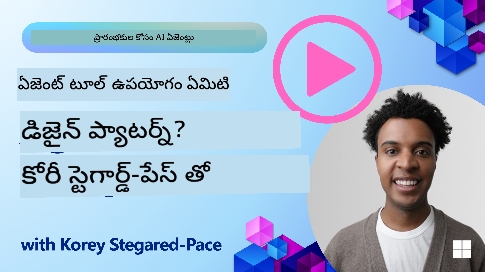
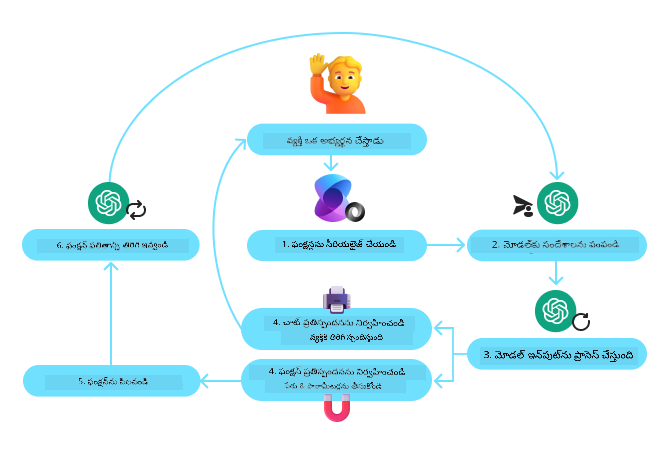

<!--
CO_OP_TRANSLATOR_METADATA:
{
  "original_hash": "d7c3b7bd1b3528074d8b6a7c5ad33b6f",
  "translation_date": "2025-12-03T16:50:06+00:00",
  "source_file": "04-tool-use/README.md",
  "language_code": "te"
}
-->
[](https://youtu.be/vieRiPRx-gI?si=cEZ8ApnT6Sus9rhn)

> _(ఈ పాఠం వీడియోను చూడటానికి పై చిత్రంపై క్లిక్ చేయండి)_

# టూల్ యూజ్ డిజైన్ ప్యాటర్న్

టూల్స్ ఆసక్తికరమైనవి ఎందుకంటే అవి AI ఏజెంట్లకు విస్తృత శ్రేణి సామర్థ్యాలను కల్పిస్తాయి. ఏజెంట్ చేయగలిగే చర్యల పరిమిత సెట్ కలిగి ఉండటానికి బదులుగా, ఒక టూల్‌ను జోడించడం ద్వారా, ఏజెంట్ ఇప్పుడు విస్తృత శ్రేణి చర్యలను చేయగలదు. ఈ అధ్యాయంలో, AI ఏజెంట్లు తమ లక్ష్యాలను సాధించడానికి నిర్దిష్ట టూల్స్‌ను ఎలా ఉపయోగించగలరో వివరిస్తున్న టూల్ యూజ్ డిజైన్ ప్యాటర్న్‌ను పరిశీలిస్తాము.

## పరిచయం

ఈ పాఠంలో, మేము ఈ ప్రశ్నలకు సమాధానం ఇవ్వడానికి ప్రయత్నిస్తున్నాము:

- టూల్ యూజ్ డిజైన్ ప్యాటర్న్ అంటే ఏమిటి?
- ఇది వర్తించగల ఉపయోగాలు ఏమిటి?
- డిజైన్ ప్యాటర్న్‌ను అమలు చేయడానికి అవసరమైన అంశాలు/నిర్మాణ బ్లాక్స్ ఏమిటి?
- నమ్మకమైన AI ఏజెంట్లను నిర్మించడానికి టూల్ యూజ్ డిజైన్ ప్యాటర్న్‌ను ఉపయోగించడానికి ప్రత్యేకమైన అంశాలు ఏమిటి?

## అభ్యాస లక్ష్యాలు

ఈ పాఠాన్ని పూర్తి చేసిన తర్వాత, మీరు:

- టూల్ యూజ్ డిజైన్ ప్యాటర్న్ మరియు దాని ఉద్దేశాన్ని నిర్వచించగలరు.
- టూల్ యూజ్ డిజైన్ ప్యాటర్న్ వర్తించే ఉపయోగాలను గుర్తించగలరు.
- డిజైన్ ప్యాటర్న్‌ను అమలు చేయడానికి అవసరమైన కీలక అంశాలను అర్థం చేసుకోగలరు.
- ఈ డిజైన్ ప్యాటర్న్‌ను ఉపయోగించే AI ఏజెంట్లలో నమ్మకాన్ని నిర్ధారించడానికి అవసరమైన అంశాలను గుర్తించగలరు.

## టూల్ యూజ్ డిజైన్ ప్యాటర్న్ అంటే ఏమిటి?

**టూల్ యూజ్ డిజైన్ ప్యాటర్న్** అనేది LLMs (లార్జ్ లాంగ్వేజ్ మోడల్స్)కు నిర్దిష్ట లక్ష్యాలను సాధించడానికి బాహ్య టూల్స్‌తో పరస్పర చర్య చేయగల సామర్థ్యాన్ని ఇవ్వడంపై దృష్టి సారిస్తుంది. టూల్స్ అనేవి ఏజెంట్ చర్యలు చేయడానికి అమలు చేయగల కోడ్. టూల్ అనేది కేలిక్యులేటర్ వంటి సింపుల్ ఫంక్షన్ లేదా స్టాక్ ధరల లుకప్ లేదా వాతావరణ సూచన వంటి థర్డ్-పార్టీ సర్వీస్‌కు API కాల్ కావచ్చు. AI ఏజెంట్ల సందర్భంలో, టూల్స్ **మోడల్-జనరేటెడ్ ఫంక్షన్ కాల్స్**కు ప్రతిస్పందనగా ఏజెంట్లచే అమలు చేయడానికి రూపొందించబడతాయి.

## ఇది వర్తించగల ఉపయోగాలు ఏమిటి?

AI ఏజెంట్లు టూల్స్‌ను ఉపయోగించి క్లిష్టమైన పనులను పూర్తి చేయడం, సమాచారం పొందడం లేదా నిర్ణయాలు తీసుకోవడం చేయగలరు. టూల్ యూజ్ డిజైన్ ప్యాటర్న్ తరచుగా డైనమిక్ ఇంటరాక్షన్ అవసరమయ్యే సన్నివేశాల్లో ఉపయోగించబడుతుంది, ఉదాహరణకు డేటాబేస్‌లు, వెబ్ సర్వీసులు లేదా కోడ్ ఇంటర్‌ప్రెటర్లు. ఈ సామర్థ్యం అనేక ఉపయోగాల కోసం ఉపయోగపడుతుంది, వాటిలో కొన్ని:

- **డైనమిక్ ఇన్ఫర్మేషన్ రిట్రీవల్:** ఏజెంట్లు SQLite డేటాబేస్‌ను ప్రశ్నించడం, స్టాక్ ధరలు లేదా వాతావరణ సమాచారం పొందడం వంటి తాజా డేటాను పొందడానికి బాహ్య APIs లేదా డేటాబేస్‌లను ప్రశ్నించగలరు.
- **కోడ్ ఎగ్జిక్యూషన్ మరియు ఇంటర్‌ప్రెటేషన్:** ఏజెంట్లు గణిత సమస్యలను పరిష్కరించడానికి, నివేదికలను రూపొందించడానికి లేదా సిమ్యులేషన్లను నిర్వహించడానికి కోడ్ లేదా స్క్రిప్ట్‌లను అమలు చేయగలరు.
- **వర్క్‌ఫ్లో ఆటోమేషన్:** టాస్క్ షెడ్యూలర్లు, ఇమెయిల్ సర్వీసులు లేదా డేటా పైప్‌లైన్ల వంటి టూల్స్‌ను సమీకరించడం ద్వారా పునరావృత లేదా బహుళ-దశల వర్క్‌ఫ్లోలను ఆటోమేట్ చేయడం.
- **కస్టమర్ సపోర్ట్:** ఏజెంట్లు CRM సిస్టమ్స్, టికెటింగ్ ప్లాట్‌ఫారమ్‌లు లేదా నాలెడ్జ్ బేస్‌లతో పరస్పర చర్య చేయడం ద్వారా వినియోగదారుల ప్రశ్నలను పరిష్కరించగలరు.
- **కంటెంట్ జనరేషన్ మరియు ఎడిటింగ్:** ఏజెంట్లు వ్యాకరణ తనిఖీ, టెక్స్ట్ సారాంశం లేదా కంటెంట్ సేఫ్టీ ఎవాల్యుయేటర్‌ల వంటి టూల్స్‌ను ఉపయోగించి కంటెంట్ సృష్టి పనులను సులభతరం చేయగలరు.

## టూల్ యూజ్ డిజైన్ ప్యాటర్న్‌ను అమలు చేయడానికి అవసరమైన అంశాలు/నిర్మాణ బ్లాక్స్ ఏమిటి?

ఈ నిర్మాణ బ్లాక్స్ AI ఏజెంట్‌కు విస్తృత శ్రేణి పనులను నిర్వహించడానికి అనుమతిస్తాయి. టూల్ యూజ్ డిజైన్ ప్యాటర్న్‌ను అమలు చేయడానికి అవసరమైన కీలక అంశాలను చూద్దాం:

- **ఫంక్షన్/టూల్ స్కీమాలు**: అందుబాటులో ఉన్న టూల్స్ యొక్క వివరమైన నిర్వచనాలు, ఫంక్షన్ పేరు, ఉద్దేశం, అవసరమైన పారామీటర్లు మరియు ఆశించిన అవుట్‌పుట్‌లను కలిగి ఉంటాయి. ఈ స్కీమాలు LLMకు అందుబాటులో ఉన్న టూల్స్ ఏమిటి మరియు చెల్లుబాటు అయ్యే అభ్యర్థనలను ఎలా నిర్మించాలో అర్థం చేసుకోవడానికి సహాయపడతాయి.

- **ఫంక్షన్ ఎగ్జిక్యూషన్ లాజిక్**: వినియోగదారుని ఉద్దేశం మరియు సంభాషణ సందర్భం ఆధారంగా టూల్స్ ఎప్పుడు మరియు ఎలా పిలవబడతాయో నియంత్రిస్తుంది. ఇది ప్లానర్ మాడ్యూల్స్, రూటింగ్ మెకానిజం లేదా టూల్ వినియోగాన్ని డైనమిక్‌గా నిర్ణయించే షరతు ప్రవాహాలను కలిగి ఉండవచ్చు.

- **మెసేజ్ హ్యాండ్లింగ్ సిస్టమ్**: వినియోగదారు ఇన్‌పుట్‌లు, LLM ప్రతిస్పందనలు, టూల్ కాల్స్ మరియు టూల్ అవుట్‌పుట్‌ల మధ్య సంభాషణ ప్రవాహాన్ని నిర్వహించే భాగాలు.

- **టూల్ ఇంటిగ్రేషన్ ఫ్రేమ్‌వర్క్**: ఏజెంట్‌ను వివిధ టూల్స్‌తో కనెక్ట్ చేసే మౌలిక సదుపాయాలు, అవి సింపుల్ ఫంక్షన్‌లు లేదా క్లిష్టమైన బాహ్య సేవలు కావచ్చు.

- **ఎర్రర్ హ్యాండ్లింగ్ & వాలిడేషన్**: టూల్ అమలు లోపాలను నిర్వహించడం, పారామీటర్లను ధృవీకరించడం మరియు అనూహ్యమైన ప్రతిస్పందనలను నిర్వహించడం.

- **స్టేట్ మేనేజ్‌మెంట్**: సంభాషణ సందర్భం, గత టూల్ పరస్పర చర్యలు మరియు స్థిరమైన డేటాను ట్రాక్ చేయడం ద్వారా బహుళ-మలుపు పరస్పర చర్యలలో స్థిరత్వాన్ని నిర్ధారిస్తుంది.

తదుపరి, ఫంక్షన్/టూల్ కాలింగ్‌ను మరింత వివరంగా చూద్దాం.

### ఫంక్షన్/టూల్ కాలింగ్

ఫంక్షన్ కాలింగ్ అనేది లార్జ్ లాంగ్వేజ్ మోడల్స్ (LLMs) టూల్స్‌తో పరస్పర చర్య చేయగల సామర్థ్యాన్ని సాధించడానికి ప్రధాన మార్గం. 'ఫంక్షన్' మరియు 'టూల్' తరచుగా పరస్పరం ఉపయోగించబడతాయి ఎందుకంటే 'ఫంక్షన్‌లు' (పునర్వినియోగపరచదగిన కోడ్ బ్లాక్స్) ఏజెంట్లు పనులను నిర్వహించడానికి ఉపయోగించే 'టూల్స్'. ఒక ఫంక్షన్ యొక్క కోడ్ అమలు చేయబడటానికి, LLM వినియోగదారుని అభ్యర్థనను ఫంక్షన్ వివరణతో పోల్చాలి. అందుబాటులో ఉన్న అన్ని ఫంక్షన్‌ల వివరణలను కలిగి ఉన్న స్కీమాను LLMకు పంపుతారు. LLM ఆ పనికి అత్యంత అనుకూలమైన ఫంక్షన్‌ను ఎంచుకుని దాని పేరు మరియు ఆర్గుమెంట్లను తిరిగి పంపుతుంది. ఎంపిక చేసిన ఫంక్షన్ అమలు చేయబడుతుంది, దాని ప్రతిస్పందన LLMకు తిరిగి పంపబడుతుంది, ఇది వినియోగదారుని అభ్యర్థనకు ప్రతిస్పందించడానికి సమాచారాన్ని ఉపయోగిస్తుంది.

ఏజెంట్ల కోసం ఫంక్షన్ కాలింగ్‌ను అమలు చేయడానికి డెవలపర్లు అవసరం:

1. ఫంక్షన్ కాలింగ్‌ను మద్దతు ఇచ్చే LLM మోడల్
2. ఫంక్షన్ వివరణలను కలిగి ఉన్న స్కీమా
3. వివరణలో ఉన్న ప్రతి ఫంక్షన్ కోసం కోడ్

సిటీలో ప్రస్తుత సమయాన్ని పొందడం ఉదాహరణగా తీసుకుందాం:

1. **ఫంక్షన్ కాలింగ్‌ను మద్దతు ఇచ్చే LLMను ప్రారంభించండి:**

    అన్ని మోడల్స్ ఫంక్షన్ కాలింగ్‌ను మద్దతు ఇవ్వవు, కాబట్టి మీరు ఉపయోగిస్తున్న LLM మద్దతు ఇస్తుందో లేదో తనిఖీ చేయడం ముఖ్యం. <a href="https://learn.microsoft.com/azure/ai-services/openai/how-to/function-calling" target="_blank">Azure OpenAI</a> ఫంక్షన్ కాలింగ్‌ను మద్దతు ఇస్తుంది. మేము Azure OpenAI క్లయింట్‌ను ప్రారంభించడం ద్వారా ప్రారంభించవచ్చు.

    ```python
    # ఆజూర్ ఓపెన్‌ఏఐ క్లయింట్‌ను ప్రారంభించండి
    client = AzureOpenAI(
        azure_endpoint = os.getenv("AZURE_OPENAI_ENDPOINT"), 
        api_key=os.getenv("AZURE_OPENAI_API_KEY"),  
        api_version="2024-05-01-preview"
    )
    ```

1. **ఫంక్షన్ స్కీమాను సృష్టించండి:**

    తరువాత, ఫంక్షన్ పేరు, ఫంక్షన్ ఏమి చేస్తుందో వివరణ మరియు ఫంక్షన్ పారామీటర్ల పేర్లు మరియు వివరణలను కలిగి ఉన్న JSON స్కీమాను నిర్వచిస్తాము. ఈ స్కీమాను మునుపు సృష్టించిన క్లయింట్‌కు, అలాగే సాన్ ఫ్రాన్సిస్కోలో సమయాన్ని కనుగొనడానికి వినియోగదారుని అభ్యర్థనకు పంపుతాము. ముఖ్యంగా గమనించాల్సిన విషయం ఏమిటంటే **టూల్ కాల్** తిరిగి వస్తుంది, **ప్రశ్నకు తుది సమాధానం కాదు**. ముందుగా చెప్పినట్లుగా, LLM ఆ పనికి ఎంపిక చేసిన ఫంక్షన్ పేరు మరియు దానికి పంపబడే ఆర్గుమెంట్లను తిరిగి పంపుతుంది.

    ```python
    # మోడల్ చదవడానికి ఫంక్షన్ వివరణ
    tools = [
        {
            "type": "function",
            "function": {
                "name": "get_current_time",
                "description": "Get the current time in a given location",
                "parameters": {
                    "type": "object",
                    "properties": {
                        "location": {
                            "type": "string",
                            "description": "The city name, e.g. San Francisco",
                        },
                    },
                    "required": ["location"],
                },
            }
        }
    ]
    ```
   
    ```python
  
    # ప్రారంభ వినియోగదారు సందేశం
    messages = [{"role": "user", "content": "What's the current time in San Francisco"}] 
  
    # మొదటి API కాల్: ఫంక్షన్ ఉపయోగించమని మోడల్‌ను అడగండి
      response = client.chat.completions.create(
          model=deployment_name,
          messages=messages,
          tools=tools,
          tool_choice="auto",
      )
  
      # మోడల్ యొక్క ప్రతిస్పందనను ప్రాసెస్ చేయండి
      response_message = response.choices[0].message
      messages.append(response_message)
  
      print("Model's response:")  

      print(response_message)
  
    ```

    ```bash
    Model's response:
    ChatCompletionMessage(content=None, role='assistant', function_call=None, tool_calls=[ChatCompletionMessageToolCall(id='call_pOsKdUlqvdyttYB67MOj434b', function=Function(arguments='{"location":"San Francisco"}', name='get_current_time'), type='function')])
    ```
  
1. **పని చేయడానికి అవసరమైన ఫంక్షన్ కోడ్:**

    ఇప్పుడు LLM ఏ ఫంక్షన్ అమలు చేయాలో ఎంచుకుంది, పని చేయడానికి అవసరమైన కోడ్ అమలు చేయబడాలి. మేము ప్రస్తుత సమయాన్ని పొందడానికి Pythonలో కోడ్‌ను అమలు చేయవచ్చు. ఫైనల్ రిజల్ట్‌ను పొందడానికి response_message నుండి పేరు మరియు ఆర్గుమెంట్లను ఎక్స్‌ట్రాక్ట్ చేయడానికి కోడ్ కూడా రాయాలి.

    ```python
      def get_current_time(location):
        """Get the current time for a given location"""
        print(f"get_current_time called with location: {location}")  
        location_lower = location.lower()
        
        for key, timezone in TIMEZONE_DATA.items():
            if key in location_lower:
                print(f"Timezone found for {key}")  
                current_time = datetime.now(ZoneInfo(timezone)).strftime("%I:%M %p")
                return json.dumps({
                    "location": location,
                    "current_time": current_time
                })
      
        print(f"No timezone data found for {location_lower}")  
        return json.dumps({"location": location, "current_time": "unknown"})
    ```

     ```python
     # ఫంక్షన్ కాల్స్‌ను నిర్వహించండి
      if response_message.tool_calls:
          for tool_call in response_message.tool_calls:
              if tool_call.function.name == "get_current_time":
     
                  function_args = json.loads(tool_call.function.arguments)
     
                  time_response = get_current_time(
                      location=function_args.get("location")
                  )
     
                  messages.append({
                      "tool_call_id": tool_call.id,
                      "role": "tool",
                      "name": "get_current_time",
                      "content": time_response,
                  })
      else:
          print("No tool calls were made by the model.")  
  
      # రెండవ API కాల్: మోడల్ నుండి తుది ప్రతిస్పందనను పొందండి
      final_response = client.chat.completions.create(
          model=deployment_name,
          messages=messages,
      )
  
      return final_response.choices[0].message.content
     ```

     ```bash
      get_current_time called with location: San Francisco
      Timezone found for san francisco
      The current time in San Francisco is 09:24 AM.
     ```

ఫంక్షన్ కాలింగ్ అనేది చాలా, లేకపోతే అన్ని ఏజెంట్ టూల్ యూజ్ డిజైన్‌లో హృదయంగా ఉంటుంది, అయితే దాన్ని ప్రారంభం నుండి అమలు చేయడం కొంచెం క్లిష్టంగా ఉండవచ్చు. [Lesson 2](../../../02-explore-agentic-frameworks)లో నేర్చుకున్నట్లుగా, ఏజెంటిక్ ఫ్రేమ్‌వర్క్‌లు టూల్ యూజ్‌ను అమలు చేయడానికి మాకు ప్రీ-బిల్ట్ నిర్మాణ బ్లాక్స్‌ను అందిస్తాయి.

## ఏజెంటిక్ ఫ్రేమ్‌వర్క్‌లతో టూల్ యూజ్ ఉదాహరణలు

వివిధ ఏజెంటిక్ ఫ్రేమ్‌వర్క్‌లను ఉపయోగించి టూల్ యూజ్ డిజైన్ ప్యాటర్న్‌ను ఎలా అమలు చేయవచ్చో కొన్ని ఉదాహరణలు ఇక్కడ ఉన్నాయి:

### సెమాంటిక్ కర్నెల్

<a href="https://learn.microsoft.com/azure/ai-services/agents/overview" target="_blank">సెమాంటిక్ కర్నెల్</a> అనేది .NET, Python మరియు Java డెవలపర్లు లార్జ్ లాంగ్వేజ్ మోడల్స్ (LLMs)తో పని చేయడానికి రూపొందించిన ఓపెన్-సోర్స్ AI ఫ్రేమ్‌వర్క్. ఇది మీ ఫంక్షన్‌లను మరియు వాటి పారామీటర్లను మోడల్‌కు స్వయంచాలకంగా వివరిస్తుంది, <a href="https://learn.microsoft.com/semantic-kernel/concepts/ai-services/chat-completion/function-calling/?pivots=programming-language-python#1-serializing-the-functions" target="_blank">సీరియలైజింగ్</a> అనే ప్రక్రియ ద్వారా. ఇది మోడల్ మరియు మీ కోడ్ మధ్య వెనుక-ముందు కమ్యూనికేషన్‌ను కూడా నిర్వహిస్తుంది. సెమాంటిక్ కర్నెల్ వంటి ఏజెంటిక్ ఫ్రేమ్‌వర్క్‌ను ఉపయోగించడం ద్వారా, <a href="https://github.com/microsoft/semantic-kernel/blob/main/python/samples/getting_started_with_agents/openai_assistant/step4_assistant_tool_file_search.py" target="_blank">ఫైల్ సెర్చ్</a> మరియు <a href="https://github.com/microsoft/semantic-kernel/blob/main/python/samples/getting_started_with_agents/openai_assistant/step3_assistant_tool_code_interpreter.py" target="_blank">కోడ్ ఇంటర్‌ప్రెటర్</a> వంటి ప్రీ-బిల్ట్ టూల్స్‌ను యాక్సెస్ చేయవచ్చు.

సెమాంటిక్ కర్నెల్‌తో ఫంక్షన్ కాలింగ్ ప్రక్రియను వివరిస్తున్న డయాగ్రామ్:



సెమాంటిక్ కర్నెల్‌లో ఫంక్షన్‌లు/టూల్స్‌ను <a href="https://learn.microsoft.com/semantic-kernel/concepts/plugins/?pivots=programming-language-python" target="_blank">ప్లగిన్లు</a> అని పిలుస్తారు. మేము ముందు చూశాం `get_current_time` ఫంక్షన్‌ను క్లాస్‌గా మార్చి ప్లగిన్‌గా మార్చవచ్చు. మేము `kernel_function` డెకరేటర్‌ను కూడా ఇంపోర్ట్ చేయవచ్చు, ఇది ఫంక్షన్ యొక్క వివరణను తీసుకుంటుంది. మీరు GetCurrentTimePluginతో కర్నెల్‌ను సృష్టించినప్పుడు, కర్నెల్ స్వయంచాలకంగా ఫంక్షన్ మరియు దాని పారామీటర్లను సీరియలైజ్ చేస్తుంది, LLMకు పంపడానికి స్కీమాను సృష్టిస్తుంది.

```python
from semantic_kernel.functions import kernel_function

class GetCurrentTimePlugin:
    async def __init__(self, location):
        self.location = location

    @kernel_function(
        description="Get the current time for a given location"
    )
    def get_current_time(location: str = ""):
        ...

```

```python 
from semantic_kernel import Kernel

# కర్నల్‌ను సృష్టించండి
kernel = Kernel()

# ప్లగిన్‌ను సృష్టించండి
get_current_time_plugin = GetCurrentTimePlugin(location)

# ప్లగిన్‌ను కర్నల్‌కు జోడించండి
kernel.add_plugin(get_current_time_plugin)
```
  
### Azure AI Agent Service

<a href="https://learn.microsoft.com/azure/ai-services/agents/overview" target="_blank">Azure AI Agent Service</a> అనేది డెవలపర్లకు అధిక నాణ్యత గల, విస్తరించగల AI ఏజెంట్లను సురక్షితంగా నిర్మించడానికి, మోహరించడానికి మరియు స్కేల్ చేయడానికి రూపొందించిన కొత్త ఏజెంటిక్ ఫ్రేమ్‌వర్క్. ఇది అంతర్గత కంప్యూట్ మరియు స్టోరేజ్ వనరులను నిర్వహించాల్సిన అవసరం లేకుండా పూర్తిగా నిర్వహించబడే సేవ. ఇది ఎంటర్‌ప్రైజ్ అప్లికేషన్లకు ప్రత్యేకంగా ఉపయోగకరంగా ఉంటుంది ఎందుకంటే ఇది ఎంటర్‌ప్రైజ్ గ్రేడ్ సెక్యూరిటీతో కూడిన పూర్తిగా నిర్వహించబడే సేవ.

LLM APIతో నేరుగా అభివృద్ధి చేయడం తో పోలిస్తే, Azure AI Agent Service కొన్ని ప్రయోజనాలను అందిస్తుంది, వాటిలో:

- ఆటోమేటిక్ టూల్ కాలింగ్ – టూల్ కాల్‌ను పార్స్ చేయడం, టూల్‌ను అమలు చేయడం మరియు ప్రతిస్పందనను నిర్వహించడం అవసరం లేదు; ఇది అంతా సర్వర్-సైడ్‌లో చేయబడుతుంది.
- సురక్షితంగా నిర్వహించబడే డేటా – మీ స్వంత సంభాషణ స్థితిని నిర్వహించడానికి బదులుగా, మీరు అవసరమైన అన్ని సమాచారాన్ని నిల్వ చేయడానికి థ్రెడ్స్‌పై ఆధారపడవచ్చు.
- అవుట్-ఆఫ్-ది-బాక్స్ టూల్స్ – Bing, Azure AI Search మరియు Azure Functions వంటి మీ డేటా సోర్స్‌లతో పరస్పర చర్య చేయడానికి మీరు ఉపయోగించగల టూల్స్.

Azure AI Agent Serviceలో అందుబాటులో ఉన్న టూల్స్‌ను రెండు వర్గాలుగా విభజించవచ్చు:

1. నాలెడ్జ్ టూల్స్:
    - <a href="https://learn.microsoft.com/azure/ai-services/agents/how-to/tools/bing-grounding?tabs=python&pivots=overview" target="_blank">Bing సెర్చ్‌తో గ్రౌండింగ్</a>
    - <a href="https://learn.microsoft.com/azure/ai-services/agents/how-to/tools/file-search?tabs=python&pivots=overview" target="_blank">ఫైల్ సెర్చ్</a>
    - <a href="https://learn.microsoft.com/azure/ai-services/agents/how-to/tools/azure-ai-search?tabs=azurecli%2Cpython&pivots=overview-azure-ai-search" target="_blank">Azure AI సెర్చ్</a>

2. యాక్షన్ టూల్స్:
    - <a href="https://learn.microsoft.com/azure/ai-services/agents/how-to/tools/function-calling?tabs=
అనువర్తనాన్ని సురక్షితమైన వాతావరణంలో నడపడం రక్షణను మరింత పెంచుతుంది. ఎంటర్‌ప్రైజ్ పరిస్థితుల్లో, డేటాను సాధారణంగా ఆపరేషనల్ సిస్టమ్స్ నుండి తీసుకుని, వినియోగదారులకు అనుకూలమైన స్కీమాతో రీడ్-ఓన్లీ డేటాబేస్ లేదా డేటా వేర్‌హౌస్‌లోకి మార్చుతారు. ఈ విధానం డేటా సురక్షితంగా ఉండేలా, పనితీరు మరియు యాక్సెసిబిలిటీకి అనుకూలంగా ఉండేలా చేస్తుంది, అలాగే అనువర్తనానికి పరిమితమైన, రీడ్-ఓన్లీ యాక్సెస్‌ను కల్పిస్తుంది.

## నమూనా కోడ్స్

- Python: [Agent Framework](./code_samples/04-python-agent-framework.ipynb)
- .NET: [Agent Framework](./code_samples/04-dotnet-agent-framework.md)

## టూల్ ఉపయోగ డిజైన్ ప్యాటర్న్స్ గురించి మరిన్ని ప్రశ్నలున్నాయా?

మరింత నేర్చుకునే వారికి కలవడానికి, ఆఫీస్ అవర్స్‌లో పాల్గొనడానికి మరియు మీ AI Agents ప్రశ్నలకు సమాధానాలు పొందడానికి [Azure AI Foundry Discord](https://aka.ms/ai-agents/discord)లో చేరండి.

## అదనపు వనరులు

- <a href="https://microsoft.github.io/build-your-first-agent-with-azure-ai-agent-service-workshop/" target="_blank">Azure AI Agents Service Workshop</a>
- <a href="https://github.com/Azure-Samples/contoso-creative-writer/tree/main/docs/workshop" target="_blank">Contoso Creative Writer Multi-Agent Workshop</a>
- <a href="https://learn.microsoft.com/semantic-kernel/concepts/ai-services/chat-completion/function-calling/?pivots=programming-language-python#1-serializing-the-functions" target="_blank">Semantic Kernel Function Calling Tutorial</a>
- <a href="https://github.com/microsoft/semantic-kernel/blob/main/python/samples/getting_started_with_agents/openai_assistant/step3_assistant_tool_code_interpreter.py" target="_blank">Semantic Kernel Code Interpreter</a>
- <a href="https://microsoft.github.io/autogen/dev/user-guide/core-user-guide/components/tools.html" target="_blank">Autogen Tools</a>

## గత పాఠం

[Agentic Design Patterns గురించి అవగాహన](../03-agentic-design-patterns/README.md)

## తదుపరి పాఠం

[Agentic RAG](../05-agentic-rag/README.md)

---

<!-- CO-OP TRANSLATOR DISCLAIMER START -->
**విమర్శ**:  
ఈ పత్రాన్ని AI అనువాద సేవ [Co-op Translator](https://github.com/Azure/co-op-translator) ఉపయోగించి అనువదించబడింది. మేము ఖచ్చితత్వానికి ప్రయత్నిస్తున్నప్పటికీ, ఆటోమేటెడ్ అనువాదాలలో తప్పులు లేదా అసమానతలు ఉండవచ్చు. దయచేసి, దాని స్వదేశీ భాషలోని అసలు పత్రాన్ని అధికారం కలిగిన మూలంగా పరిగణించండి. కీలకమైన సమాచారం కోసం, ప్రొఫెషనల్ మానవ అనువాదాన్ని సిఫారసు చేస్తాము. ఈ అనువాదాన్ని ఉపయోగించడం వల్ల కలిగే ఏవైనా అపార్థాలు లేదా తప్పుదారులు కోసం మేము బాధ్యత వహించము.
<!-- CO-OP TRANSLATOR DISCLAIMER END -->