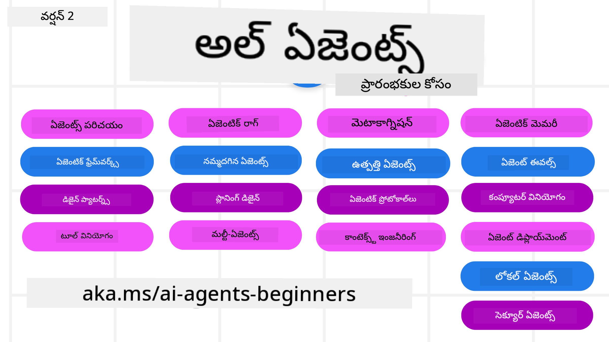

<!--
CO_OP_TRANSLATOR_METADATA:
{
  "original_hash": "218cf4d1ab3d9224f020f7e26155ef99",
  "translation_date": "2025-12-03T15:24:34+00:00",
  "source_file": "README.md",
  "language_code": "te"
}
-->
# AI ఏజెంట్ల కోసం ప్రారంభ కోర్సు

## AI ఏజెంట్లను నిర్మించడం ప్రారంభించడానికి అవసరమైన అన్ని విషయాలను నేర్పే కోర్సు

  
  
  
  

### 🌐 బహుభాషా మద్దతు

#### GitHub Action ద్వారా మద్దతు (ఆటోమేటెడ్ & ఎల్లప్పుడూ తాజా)

[అరబిక్](../ar/README.md) | [బెంగాలీ](../bn/README.md) | [బల్గేరియన్](../bg/README.md) | [బర్మీస్ (మయన్మార్)](../my/README.md) | [చైనీస్ (సింప్లిఫైడ్)](../zh/README.md) | [చైనీస్ (ట్రెడిషనల్, హాంగ్ కాంగ్)](../hk/README.md) | [చైనీస్ (ట్రెడిషనల్, మకావు)](../mo/README.md) | [చైనీస్ (ట్రెడిషనల్, తైవాన్)](../tw/README.md) | [క్రొయేషియన్](../hr/README.md) | [చెక్](../cs/README.md) | [డానిష్](../da/README.md) | [డచ్](../nl/README.md) | [ఎస్టోనియన్](../et/README.md) | [ఫిన్నిష్](../fi/README.md) | [ఫ్రెంచ్](../fr/README.md) | [జర్మన్](../de/README.md) | [గ్రీక్](../el/README.md) | [హీబ్రూ](../he/README.md) | [హిందీ](../hi/README.md) | [హంగేరియన్](../hu/README.md) | [ఇండోనేషియన్](../id/README.md) | [ఇటాలియన్](../it/README.md) | [జపనీస్](../ja/README.md) | [కన్నడ](../kn/README.md) | [కొరియన్](../ko/README.md) | [లిథువేనియన్](../lt/README.md) | [మలయ్](../ms/README.md) | [మలయాళం](../ml/README.md) | [మరాఠీ](../mr/README.md) | [నేపాలి](../ne/README.md) | [నైజీరియన్ పిడ్జిన్](../pcm/README.md) | [నార్వేజియన్](../no/README.md) | [పర్షియన్ (ఫార్సీ)](../fa/README.md) | [పోలిష్](../pl/README.md) | [పోర్చుగీస్ (బ్రెజిల్)](../br/README.md) | [పోర్చుగీస్ (పోర్చుగల్)](../pt/README.md) | [పంజాబీ (గుర్ముఖి)](../pa/README.md) | [రోమేనియన్](../ro/README.md) | [రష్యన్](../ru/README.md) | [సెర్బియన్ (సిరిలిక్)](../sr/README.md) | [స్లోవాక్](../sk/README.md) | [స్లోవేనియన్](../sl/README.md) | [స్పానిష్](../es/README.md) | [స్వాహిలి](../sw/README.md) | [స్వీడిష్](../sv/README.md) | [టాగాలాగ్ (ఫిలిపినో)](../tl/README.md) | [తమిళం](../ta/README.md) | [తెలుగు](./README.md) | [థాయ్](../th/README.md) | [టర్కిష్](../tr/README.md) | [ఉక్రేనియన్](../uk/README.md) | [ఉర్దూ](../ur/README.md) | [వియత్నామీస్](../vi/README.md)

**మరింత భాషా మద్దతు కావాలనుకుంటే, [ఇక్కడ](https://github.com/Azure/co-op-translator/blob/main/getting_started/supported-languages.md) అందుబాటులో ఉన్న భాషలను చూడండి**

  
  

## 🌱 ప్రారంభం

ఈ కోర్సులో AI ఏజెంట్లను నిర్మించడానికి అవసరమైన ప్రాథమిక అంశాలను కవర్ చేసే పాఠాలు ఉన్నాయి. ప్రతి పాఠం ప్రత్యేకమైన అంశాన్ని కవర్ చేస్తుంది, కాబట్టి మీకు అనుకూలమైన చోట ప్రారంభించండి!

ఈ కోర్సుకు బహుభాషా మద్దతు ఉంది. మా [అందుబాటులో ఉన్న భాషలను](../..) చూడండి.

జనరేటివ్ AI మోడల్స్‌తో మొదటిసారి నిర్మించడం ప్రారంభిస్తే, మా [జనరేటివ్ AI ప్రారంభ కోర్సు](https://aka.ms/genai-beginners) చూడండి, ఇందులో GenAIతో నిర్మించడానికి 21 పాఠాలు ఉన్నాయి.

ఈ రిపోను [స్టార్ (🌟)](https://docs.github.com/en/get-started/exploring-projects-on-github/saving-repositories-with-stars?WT.mc_id=academic-105485-koreyst) చేయడం మరియు [ఫోర్క్](https://github.com/microsoft/ai-agents-for-beginners/fork) చేయడం మర్చిపోవద్దు.

### ఇతర విద్యార్థులను కలవండి, మీ ప్రశ్నలకు సమాధానం పొందండి

మీకు ఏదైనా సమస్యలు ఉంటే లేదా AI ఏజెంట్లను నిర్మించడం గురించి ప్రశ్నలు ఉంటే, [Microsoft Foundry Discord](https://aka.ms/ai-agents/discord)లో మా ప్రత్యేకమైన డిస్కార్డ్ ఛానెల్‌లో చేరండి.

### మీకు అవసరమైనవి

ఈ కోర్సులోని ప్రతి పాఠంలో కోడ్ ఉదాహరణలు ఉన్నాయి, ఇవి code_samples ఫోల్డర్‌లో ఉన్నాయి. మీ స్వంత కాపీని సృష్టించడానికి మీరు [ఈ రిపోను ఫోర్క్](https://github.com/microsoft/ai-agents-for-beginners/fork) చేయవచ్చు.

ఈ వ్యాయామాల్లోని కోడ్ ఉదాహరణలు, భాషా మోడల్స్‌తో ఇంటరాక్ట్ చేయడానికి Azure AI Foundry మరియు GitHub Model Catalogs ఉపయోగిస్తాయి:

- [GitHub మోడల్స్](https://aka.ms/ai-agents-beginners/github-models) - ఉచితం / పరిమిత  
- [Azure AI Foundry](https://aka.ms/ai-agents-beginners/ai-foundry) - Azure ఖాతా అవసరం

ఈ కోర్సు Microsoft నుండి క్రింది AI ఏజెంట్ ఫ్రేమ్‌వర్క్‌లు మరియు సేవలను ఉపయోగిస్తుంది:

- [Microsoft Agent Framework (MAF) - కొత్తది!](https://aka.ms/ai-agents-beginners/agent-framewrok)  
- [Azure AI Agent Service](https://aka.ms/ai-agents-beginners/ai-agent-service)  
- [Semantic Kernel](https://aka.ms/ai-agents-beginners/semantic-kernel)  
- [AutoGen](https://aka.ms/ai-agents/autogen)

ఈ కోర్సు కోసం కోడ్‌ను ఎలా రన్ చేయాలో మరింత సమాచారం కోసం, [కోర్సు సెటప్](./00-course-setup/README.md) చూడండి.

## 🙏 సహాయం చేయాలనుకుంటున్నారా?

మీకు సూచనలు ఉన్నాయా లేదా ఎటువంటి స్పెల్లింగ్ లేదా కోడ్ లోపాలను కనుగొన్నారా? [సమస్యను రేపండి](https://github.com/microsoft/ai-agents-for-beginners/issues?WT.mc_id=academic-105485-koreyst) లేదా [పుల్ రిక్వెస్ట్ సృష్టించండి](https://github.com/microsoft/ai-agents-for-beginners/pulls?WT.mc_id=academic-105485-koreyst).

## 📂 ప్రతి పాఠంలో ఉన్నాయి

- READMEలో ఉన్న రాత పాఠం మరియు చిన్న వీడియో  
- Azure AI Foundry మరియు GitHub మోడల్స్ (ఉచితం) మద్దతు ఉన్న Python కోడ్ ఉదాహరణలు  
- మీ అభ్యాసాన్ని కొనసాగించడానికి అదనపు వనరుల లింకులు  

## 🗃️ పాఠాలు

| **పాఠం**                                   | **టెక్స్ట్ & కోడ్**                                | **వీడియో**                                                  | **అదనపు అభ్యాసం**                                                                     |
|--------------------------------------------|----------------------------------------------------|------------------------------------------------------------|----------------------------------------------------------------------------------------|
| AI ఏజెంట్లు మరియు ఏజెంట్ ఉపయోగం పరిచయం     | [లింక్](./01-intro-to-ai-agents/README.md)         | [వీడియో](https://youtu.be/3zgm60bXmQk?si=z8QygFvYQv-9WtO1)  | [లింక్](https://aka.ms/ai-agents-beginners/collection?WT.mc_id=academic-105485-koreyst) |
| AI ఏజెంటిక్ ఫ్రేమ్‌వర్క్‌ల అన్వేషణ          | [లింక్](./02-explore-agentic-frameworks/README.md) | [వీడియో](https://youtu.be/ODwF-EZo_O8?si=Vawth4hzVaHv-u0H)  | [లింక్](https://aka.ms/ai-agents-beginners/collection?WT.mc_id=academic-105485-koreyst) |
| AI ఏజెంటిక్ డిజైన్ ప్యాటర్న్‌లను అర్థం చేసుకోవడం | [లింక్](./03-agentic-design-patterns/README.md)    | [వీడియో](https://youtu.be/m9lM8qqoOEA?si=BIzHwzstTPL8o9GF)  | [లింక్](https://aka.ms/ai-agents-beginners/collection?WT.mc_id=academic-105485-koreyst) |
| టూల్ ఉపయోగం డిజైన్ ప్యాటర్న్               | [లింక్](./04-tool-use/README.md)                   | [వీడియో](https://youtu.be/vieRiPRx-gI?si=2z6O2Xu2cu_Jz46N)  | [లింక్](https://aka.ms/ai-agents-beginners/collection?WT.mc_id=academic-105485-koreyst) |
| ఏజెంటిక్ RAG                                | [లింక్](./05-agentic-rag/README.md)                | [వీడియో](https://youtu.be/WcjAARvdL7I?si=gKPWsQpKiIlDH9A3)  | [లింక్](https://aka.ms/ai-agents-beginners/collection?WT.mc_id=academic-105485-koreyst) |
| నమ్మకమైన AI ఏజెంట్లను నిర్మించడం            | [లింక్](./06-building-trustworthy-agents/README.md)| [వీడియో](https://youtu.be/iZKkMEGBCUQ?si=jZjpiMnGFOE9L8OK ) | [లింక్](https://aka.ms/ai-agents-beginners/collection?WT.mc_id=academic-105485-koreyst) |
| ప్లానింగ్ డిజైన్ ప్యాటర్న్                  | [లింక్](./07-planning-design/README.md)            | [వీడియో](https://youtu.be/kPfJ2BrBCMY?si=6SC_iv_E5-mzucnC)  | [లింక్](https://aka.ms/ai-agents-beginners/collection?WT.mc_id=academic-105485-koreyst) |
| మల్టీ-ఏజెంట్ డిజైన్ ప్యాటర్న్              | [లింక్](./08-multi-agent/README.md)                | [వీడియో](https://youtu.be/V6HpE9hZEx0?si=rMgDhEu7wXo2uo6g)  | [లింక్](https://aka.ms/ai-agents-beginners/collection?WT.mc_id=academic-105485-koreyst) |
| మెటాకాగ్నిషన్ డిజైన్ ప్యాటర్న్              | [లింక్](./09-metacognition/README.md)              | [వీడియో](https://youtu.be/His9R6gw6Ec?si=8gck6vvdSNCt6OcF)  | [లింక్](https://aka.ms/ai-agents-beginners/collection?WT.mc_id=academic-105485-koreyst) |
| ప్రొడక్షన్‌లో AI ఏజెంట్లు                      | [లింక్](./10-ai-agents-production/README.md)        | [వీడియో](https://youtu.be/l4TP6IyJxmQ?si=31dnhexRo6yLRJDl)  | [లింక్](https://aka.ms/ai-agents-beginners/collection?WT.mc_id=academic-105485-koreyst) |
| ఏజెంటిక్ ప్రోటోకాల్‌లను ఉపయోగించడం (MCP, A2A మరియు NLWeb) | [లింక్](./11-agentic-protocols/README.md)           | [వీడియో](https://youtu.be/X-Dh9R3Opn8)                                 | [లింక్](https://aka.ms/ai-agents-beginners/collection?WT.mc_id=academic-105485-koreyst) |
| AI ఏజెంట్ల కోసం కాంటెక్స్ట్ ఇంజినీరింగ్            | [లింక్](./12-context-engineering/README.md)         | [వీడియో](https://youtu.be/F5zqRV7gEag)                                 | [లింక్](https://aka.ms/ai-agents-beginners/collection?WT.mc_id=academic-105485-koreyst) |
| ఏజెంటిక్ మెమరీని నిర్వహించడం                      | [లింక్](./13-agent-memory/README.md)     |      [వీడియో](https://youtu.be/QrYbHesIxpw?si=vZkVwKrQ4ieCcIPx)                                                      |                                                                                        |
| మైక్రోసాఫ్ట్ ఏజెంట్ ఫ్రేమ్‌వర్క్‌ను అన్వేషించడం                         | [లింక్](./14-microsoft-agent-framework/README.md)                            |                                                            |                                                                                        |
| కంప్యూటర్ యూజ్ ఏజెంట్లను (CUA) నిర్మించడం           | త్వరలో రాబోతుంది                            |                                                            |                                                                                        |
| స్కేలబుల్ ఏజెంట్లను డిప్లాయ్ చేయడం                    | త్వరలో రాబోతుంది                            |                                                            |                                                                                        |
| లోకల్ AI ఏజెంట్లను సృష్టించడం                     | త్వరలో రాబోతుంది                               |                                                            |                                                                                        |
| AI ఏజెంట్లను సురక్షితం చేయడం                           | త్వరలో రాబోతుంది                               |                                                            |                                                                                        |

## 🎒 ఇతర కోర్సులు

మా టీమ్ ఇతర కోర్సులను కూడా తయారు చేస్తుంది! చూడండి:

### Azure / Edge / MCP / ఏజెంట్లు

---

### జనరేటివ్ AI సిరీస్

[-9333EA?style=for-the-badge&labelColor=E5E7EB&color=9333EA)](https://github.com/microsoft/Generative-AI-for-beginners-dotnet?WT.mc_id=academic-105485-koreyst)
[-C084FC?style=for-the-badge&labelColor=E5E7EB&color=C084FC)](https://github.com/microsoft/generative-ai-for-beginners-java?WT.mc_id=academic-105485-koreyst)
[-E879F9?style=for-the-badge&labelColor=E5E7EB&color=E879F9)](https://github.com/microsoft/generative-ai-with-javascript?WT.mc_id=academic-105485-koreyst)

---

### కోర్ లెర్నింగ్

---

### కోపైలట్ సిరీస్

## 🌟 కమ్యూనిటీ ధన్యవాదాలు

Agentic RAGను ప్రదర్శించే ముఖ్యమైన కోడ్ నమూనాలను అందించిన [Shivam Goyal](https://www.linkedin.com/in/shivam2003/)కు ధన్యవాదాలు.

## సహకరించడం

ఈ ప్రాజెక్ట్ సహకారాలను మరియు సూచనలను స్వాగతిస్తుంది. చాలా సహకారాలు మీకు ఒక Contributor License Agreement (CLA)తో అంగీకరించాల్సి ఉంటుంది, ఇది మీరు మీ సహకారాన్ని ఉపయోగించడానికి హక్కు కలిగి ఉన్నారని మరియు నిజంగా మాకు హక్కులు ఇస్తారని ప్రకటిస్తుంది. వివరాల కోసం <https://cla.opensource.microsoft.com> సందర్శించండి.

మీరు ఒక పుల్ రిక్వెస్ట్‌ను సమర్పించినప్పుడు, CLA బాట్ మీకు CLA అందించాల్సిన అవసరం ఉందో లేదో స్వయంచాలకంగా నిర్ణయిస్తుంది మరియు PRను తగిన విధంగా అలంకరిస్తుంది (ఉదా., స్టేటస్ చెక్, కామెంట్). బాట్ అందించిన సూచనలను పాటించండి. మా CLAని ఉపయోగించే అన్ని రిపోస్‌లలో మీరు దీన్ని ఒకసారి మాత్రమే చేయాలి.

ఈ ప్రాజెక్ట్ [Microsoft Open Source Code of Conduct](https://opensource.microsoft.com/codeofconduct/)ను స్వీకరించింది. మరింత సమాచారం కోసం [Code of Conduct FAQ](https://opensource.microsoft.com/codeofconduct/faq/)ను చూడండి లేదా [opencode@microsoft.com](mailto:opencode@microsoft.com)కు మీ అదనపు ప్రశ్నలు లేదా వ్యాఖ్యలతో సంప్రదించండి.

## ట్రేడ్‌మార్క్‌లు

ఈ ప్రాజెక్ట్ ప్రాజెక్ట్‌లు, ఉత్పత్తులు లేదా సేవల కోసం ట్రేడ్‌మార్క్‌లు లేదా లోగోలను కలిగి ఉండవచ్చు. Microsoft ట్రేడ్‌మార్క్‌లు లేదా లోగోలను అనుమతించిన వినియోగం [Microsoft's Trademark & Brand Guidelines](https://www.microsoft.com/legal/intellectualproperty/trademarks/usage/general)ను అనుసరించాలి. ఈ ప్రాజెక్ట్ యొక్క సవరించిన వెర్షన్లలో Microsoft ట్రేడ్‌మార్క్‌లు లేదా లోగోలను ఉపయోగించడం గందరగోళానికి కారణం కాకూడదు లేదా Microsoft స్పాన్సర్‌షిప్‌ను సూచించకూడదు. మూడవ పక్షాల ట్రేడ్‌మార్క్‌లు లేదా లోగోలను ఉపయోగించడం ఆ మూడవ పక్షాల విధానాలకు లోబడి ఉంటుంది.

## సహాయం పొందడం

మీరు ఇరుక్కుపోతే లేదా AI యాప్‌లను నిర్మించడం గురించి ఏవైనా ప్రశ్నలు ఉంటే, చేరండి:

మీరు ఉత్పత్తి ఫీడ్‌బ్యాక్ లేదా నిర్మాణంలో లోపాలను ఎదుర్కుంటే, సందర్శించండి:

---

<!-- CO-OP TRANSLATOR DISCLAIMER START -->
**విమర్శ**:  
ఈ పత్రాన్ని AI అనువాద సేవ [Co-op Translator](https://github.com/Azure/co-op-translator) ఉపయోగించి అనువదించబడింది. మేము ఖచ్చితత్వానికి ప్రయత్నిస్తున్నప్పటికీ, ఆటోమేటెడ్ అనువాదాలలో తప్పులు లేదా అసమానతలు ఉండవచ్చు. దాని స్వదేశీ భాషలోని అసలు పత్రాన్ని అధికారం కలిగిన మూలంగా పరిగణించాలి. కీలకమైన సమాచారం కోసం, ప్రొఫెషనల్ మానవ అనువాదాన్ని సిఫారసు చేస్తాము. ఈ అనువాదాన్ని ఉపయోగించడం వల్ల కలిగే ఏవైనా అపార్థాలు లేదా తప్పుదారులు కోసం మేము బాధ్యత వహించము.
<!-- CO-OP TRANSLATOR DISCLAIMER END -->